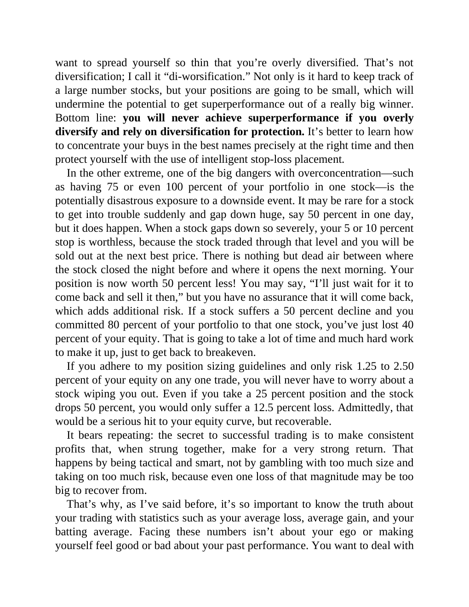

# Think and Trade Like a Champion - Page Image 146

## Source Page

Book: [[Think and Trade Like a Champion]]

## Page Read

Tags: risk-first, sell-or-failure, text-or-context-page

Concepts: [[Risk First]], [[Sell Rules and Failure Signals]]

This page is mainly text/context. It is included so the image index has complete source coverage, but it should not be treated as an independent chart pattern.

## Linked Stock Figures

- No extracted stock-figure case on this page.

## Extracted Page Text Signal

want to spread yourself so thin that you’re overly diversified. That’s not diversification; I call it “di-worsification.” Not only is it hard to keep track of a large number stocks, but your positions are going to be small, which will undermine the potential to get superperformance out of a really big winner. Bottom line: you will never achieve superperformance if you overly diversify and rely on diversification for protection. It’s better to learn how to concentrate your buys in the best names ...

## Manual Study Prompt

- What visual structure is the page trying to make obvious?
- Is the lesson about buying, avoiding, selling, or managing risk?
- If a ticker is not present, what generic behavior does the image teach?
- If a ticker is present, does the linked OHLCV rebuild confirm the same behavior?
