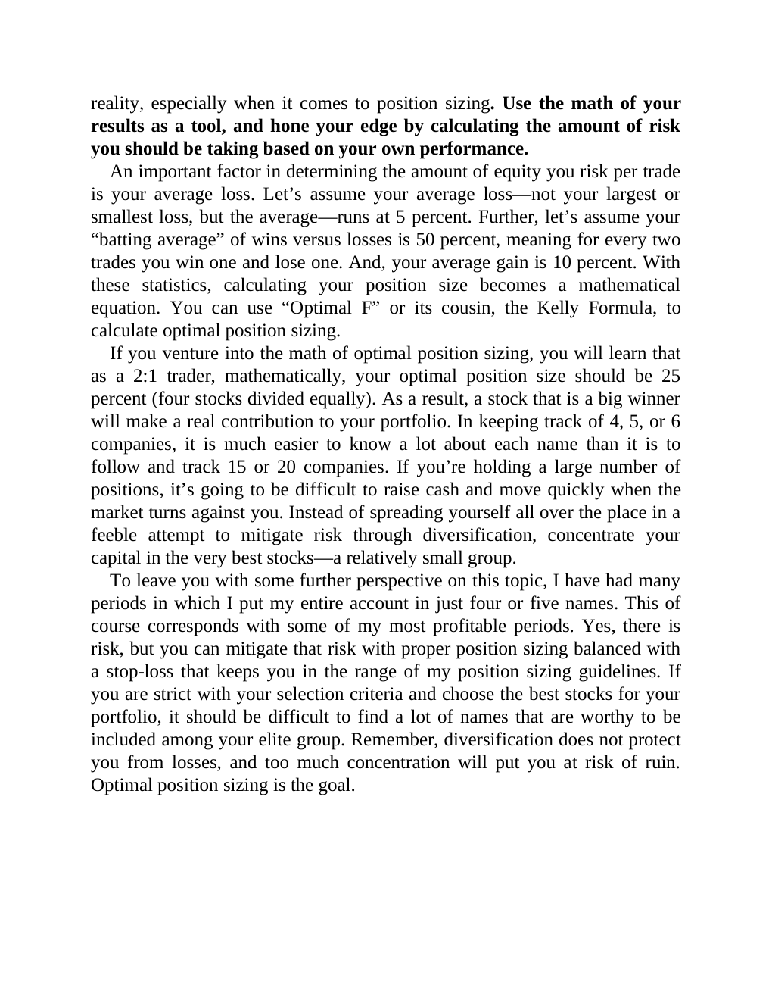

# Think and Trade Like a Champion - Page Image 147

## Source Page

Book: [[Think and Trade Like a Champion]]

## Page Read

Tags: risk-first, text-or-context-page

Concepts: [[Risk First]]

This page is mainly text/context. It is included so the image index has complete source coverage, but it should not be treated as an independent chart pattern.

## Linked Stock Figures

- No extracted stock-figure case on this page.

## Extracted Page Text Signal

reality, especially when it comes to position sizing. Use the math of your results as a tool, and hone your edge by calculating the amount of risk you should be taking based on your own performance. An important factor in determining the amount of equity you risk per trade is your average loss. Let’s assume your average loss-not your largest or smallest loss, but the average-runs at 5 percent. Further, let’s assume your “batting average” of wins versus losses is 50 percent, meaning for every two...

## Manual Study Prompt

- What visual structure is the page trying to make obvious?
- Is the lesson about buying, avoiding, selling, or managing risk?
- If a ticker is not present, what generic behavior does the image teach?
- If a ticker is present, does the linked OHLCV rebuild confirm the same behavior?
