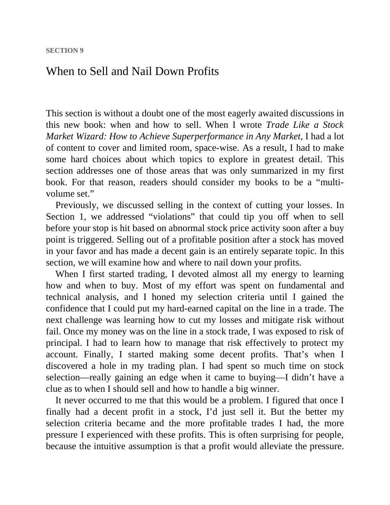

# Think and Trade Like a Champion - Page Image 148

## Source Page

Book: [[Think and Trade Like a Champion]]

## Page Read

Tags: risk-first, sell-or-failure, text-or-context-page, volume-behavior

Concepts: [[Risk First]], [[Sell Rules and Failure Signals]], [[Volume Dry-Up and Accumulation]]

This page is mainly text/context. It is included so the image index has complete source coverage, but it should not be treated as an independent chart pattern.

## Linked Stock Figures

- No extracted stock-figure case on this page.

## Extracted Page Text Signal

SECTION 9 When to Sell and Nail Down Profits This section is without a doubt one of the most eagerly awaited discussions in this new book: when and how to sell. When I wrote Trade Like a Stock Market Wizard: How to Achieve Superperformance in Any Market, I had a lot of content to cover and limited room, space-wise. As a result, I had to make some hard choices about which topics to explore in greatest detail. This section addresses one of those areas that was only summarized in my first book. For...

## Manual Study Prompt

- What visual structure is the page trying to make obvious?
- Is the lesson about buying, avoiding, selling, or managing risk?
- If a ticker is not present, what generic behavior does the image teach?
- If a ticker is present, does the linked OHLCV rebuild confirm the same behavior?
