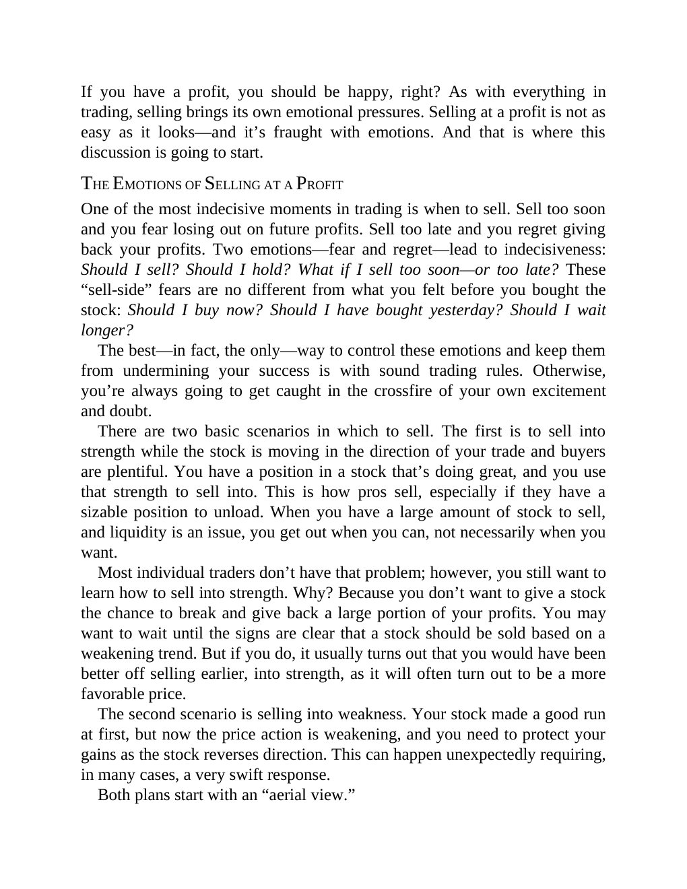

# Think and Trade Like a Champion - Page Image 149

## Source Page

Book: [[Think and Trade Like a Champion]]

## Page Read

Tags: sell-or-failure, text-or-context-page

Concepts: [[Sell Rules and Failure Signals]]

This page is mainly text/context. It is included so the image index has complete source coverage, but it should not be treated as an independent chart pattern.

## Linked Stock Figures

- No extracted stock-figure case on this page.

## Extracted Page Text Signal

If you have a profit, you should be happy, right? As with everything in trading, selling brings its own emotional pressures. Selling at a profit is not as easy as it looks-and it’s fraught with emotions. And that is where this discussion is going to start. THE EMOTIONS OF SELLING AT A PROFIT One of the most indecisive moments in trading is when to sell. Sell too soon and you fear losing out on future profits. Sell too late and you regret giving back your profits. Two emotions-fear and regret-lea...

## Manual Study Prompt

- What visual structure is the page trying to make obvious?
- Is the lesson about buying, avoiding, selling, or managing risk?
- If a ticker is not present, what generic behavior does the image teach?
- If a ticker is present, does the linked OHLCV rebuild confirm the same behavior?
