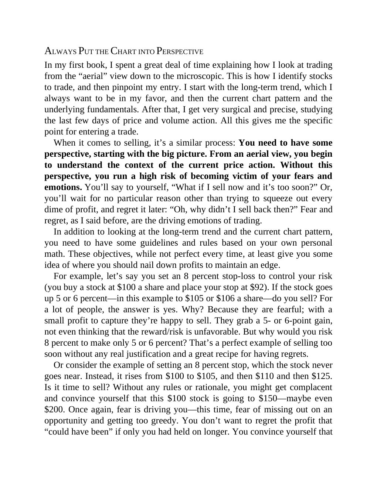

# Think and Trade Like a Champion - Page Image 150

## Source Page

Book: [[Think and Trade Like a Champion]]

## Page Read

Tags: risk-first, sell-or-failure, text-or-context-page, volume-behavior

Concepts: [[Risk First]], [[Sell Rules and Failure Signals]], [[Volume Dry-Up and Accumulation]]

This page is mainly text/context. It is included so the image index has complete source coverage, but it should not be treated as an independent chart pattern.

## Linked Stock Figures

- No extracted stock-figure case on this page.

## Extracted Page Text Signal

ALWAYS PUT THE CHART INTO PERSPECTIVE In my first book, I spent a great deal of time explaining how I look at trading from the “aerial” view down to the microscopic. This is how I identify stocks to trade, and then pinpoint my entry. I start with the long-term trend, which I always want to be in my favor, and then the current chart pattern and the underlying fundamentals. After that, I get very surgical and precise, studying the last few days of price and volume action. All this gives me the spe...

## Manual Study Prompt

- What visual structure is the page trying to make obvious?
- Is the lesson about buying, avoiding, selling, or managing risk?
- If a ticker is not present, what generic behavior does the image teach?
- If a ticker is present, does the linked OHLCV rebuild confirm the same behavior?
