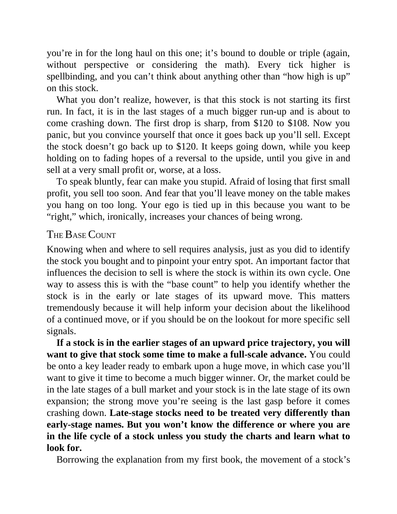

# Think and Trade Like a Champion - Page Image 151

## Source Page

Book: [[Think and Trade Like a Champion]]

## Page Read

Tags: sell-or-failure, text-or-context-page

Concepts: [[Sell Rules and Failure Signals]]

This page is mainly text/context. It is included so the image index has complete source coverage, but it should not be treated as an independent chart pattern.

## Linked Stock Figures

- No extracted stock-figure case on this page.

## Extracted Page Text Signal

you’re in for the long haul on this one; it’s bound to double or triple (again, without perspective or considering the math). Every tick higher is spellbinding, and you can’t think about anything other than “how high is up” on this stock. What you don’t realize, however, is that this stock is not starting its first run. In fact, it is in the last stages of a much bigger run-up and is about to come crashing down. The first drop is sharp, from $120 to $108. Now you panic, but you convince yourself...

## Manual Study Prompt

- What visual structure is the page trying to make obvious?
- Is the lesson about buying, avoiding, selling, or managing risk?
- If a ticker is not present, what generic behavior does the image teach?
- If a ticker is present, does the linked OHLCV rebuild confirm the same behavior?
