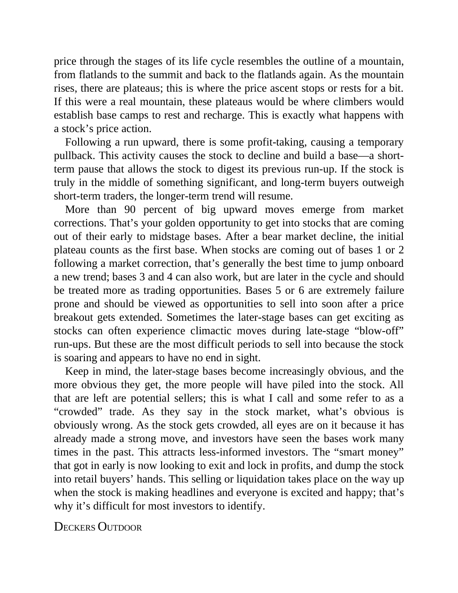

# Think and Trade Like a Champion - Page Image 152

## Source Page

Book: [[Think and Trade Like a Champion]]

## Page Read

Tags: pivot-or-entry, risk-first, sell-or-failure, text-or-context-page

Concepts: [[Pivot and Entry]], [[Risk First]], [[Sell Rules and Failure Signals]]

This page is mainly text/context. It is included so the image index has complete source coverage, but it should not be treated as an independent chart pattern.

## Linked Stock Figures

- No extracted stock-figure case on this page.

## Extracted Page Text Signal

price through the stages of its life cycle resembles the outline of a mountain, from flatlands to the summit and back to the flatlands again. As the mountain rises, there are plateaus; this is where the price ascent stops or rests for a bit. If this were a real mountain, these plateaus would be where climbers would establish base camps to rest and recharge. This is exactly what happens with a stock’s price action. Following a run upward, there is some profit-taking, causing a temporary pullback....

## Manual Study Prompt

- What visual structure is the page trying to make obvious?
- Is the lesson about buying, avoiding, selling, or managing risk?
- If a ticker is not present, what generic behavior does the image teach?
- If a ticker is present, does the linked OHLCV rebuild confirm the same behavior?
