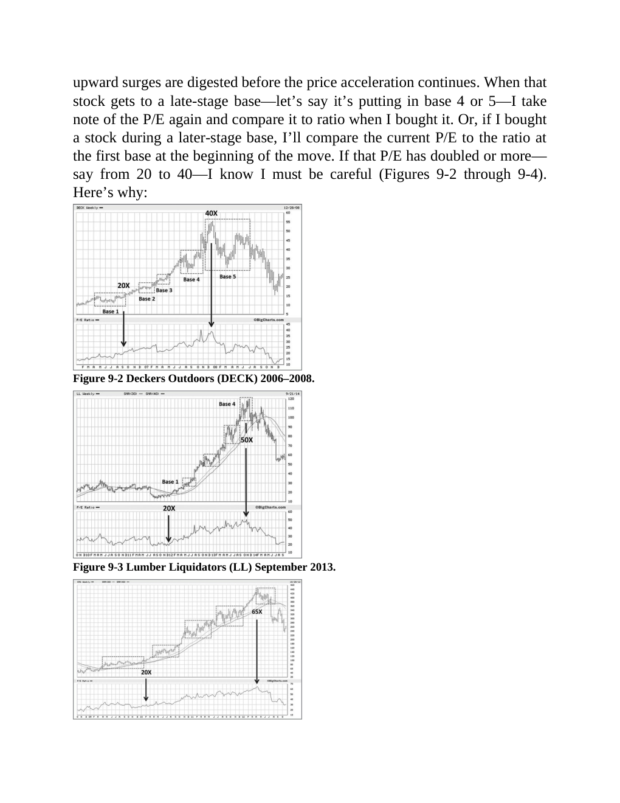

# Think and Trade Like a Champion - Page Image 154

## Source Page

Book: [[Think and Trade Like a Champion]]

## Page Read

Tags: manual-review-needed, stage-2-leadership, stock-chart-page, vcp-or-tightening

Concepts: [[Mental Discipline]], [[Pivot and Entry]], [[Relative Strength Leadership]], [[Stage 2 Uptrend]], [[Trend Template]], [[Volatility Contraction Pattern]], [[Volume Dry-Up and Accumulation]]

This page contains one or more stock-chart figures already reconciled in the stock-image layer. Study the source page first for the visual lesson, then open the linked case notes to compare it against rebuilt OHLCV data.

## Linked Stock Figures

- [[Think and Trade Like a Champion - Figure 9-2 - DECK - page 154]] - DECK - vcp-or-tightening; stage-2-leadership
- [[Think and Trade Like a Champion - Figure 9-3 - LL - page 154]] - LL - manual-review-needed

## Extracted Page Text Signal

upward surges are digested before the price acceleration continues. When that stock gets to a late-stage base-let’s say it’s putting in base 4 or 5-I take note of the P/E again and compare it to ratio when I bought it. Or, if I bought a stock during a later-stage base, I’ll compare the current P/E to the ratio at the first base at the beginning of the move. If that P/E has doubled or more- say from 20 to 40-I know I must be careful (Figures 9-2 through 9-4). Here’s why: Figure 9-2 Deckers Outdoo...

## Manual Study Prompt

- What visual structure is the page trying to make obvious?
- Is the lesson about buying, avoiding, selling, or managing risk?
- If a ticker is not present, what generic behavior does the image teach?
- If a ticker is present, does the linked OHLCV rebuild confirm the same behavior?
