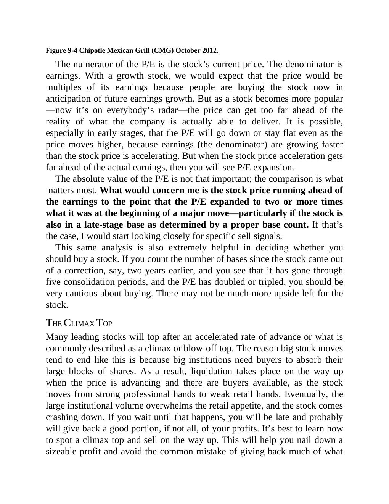

# Think and Trade Like a Champion - Page Image 155

## Source Page

Book: [[Think and Trade Like a Champion]]

## Page Read

Tags: ipo-or-new-issue, sell-or-failure, stage-2-leadership, stock-chart-page, volume-dry-up

Concepts: [[IPO Base New Issue Setup|IPO Base / New Issue Setup]], [[Relative Strength Leadership]], [[Sell Rules and Failure Signals]], [[Stage 2 Uptrend]], [[Trend Template]], [[Volume Dry-Up and Accumulation]]

This page contains one or more stock-chart figures already reconciled in the stock-image layer. Study the source page first for the visual lesson, then open the linked case notes to compare it against rebuilt OHLCV data.

## Linked Stock Figures

- [[Think and Trade Like a Champion - Figure 9-4 - CMG - page 155]] - CMG - volume-dry-up; stage-2-leadership

## Extracted Page Text Signal

Figure 9-4 Chipotle Mexican Grill (CMG) October 2012. The numerator of the P/E is the stock’s current price. The denominator is earnings. With a growth stock, we would expect that the price would be multiples of its earnings because people are buying the stock now in anticipation of future earnings growth. But as a stock becomes more popular -now it’s on everybody’s radar-the price can get too far ahead of the reality of what the company is actually able to deliver. It is possible, especially in...

## Manual Study Prompt

- What visual structure is the page trying to make obvious?
- Is the lesson about buying, avoiding, selling, or managing risk?
- If a ticker is not present, what generic behavior does the image teach?
- If a ticker is present, does the linked OHLCV rebuild confirm the same behavior?
