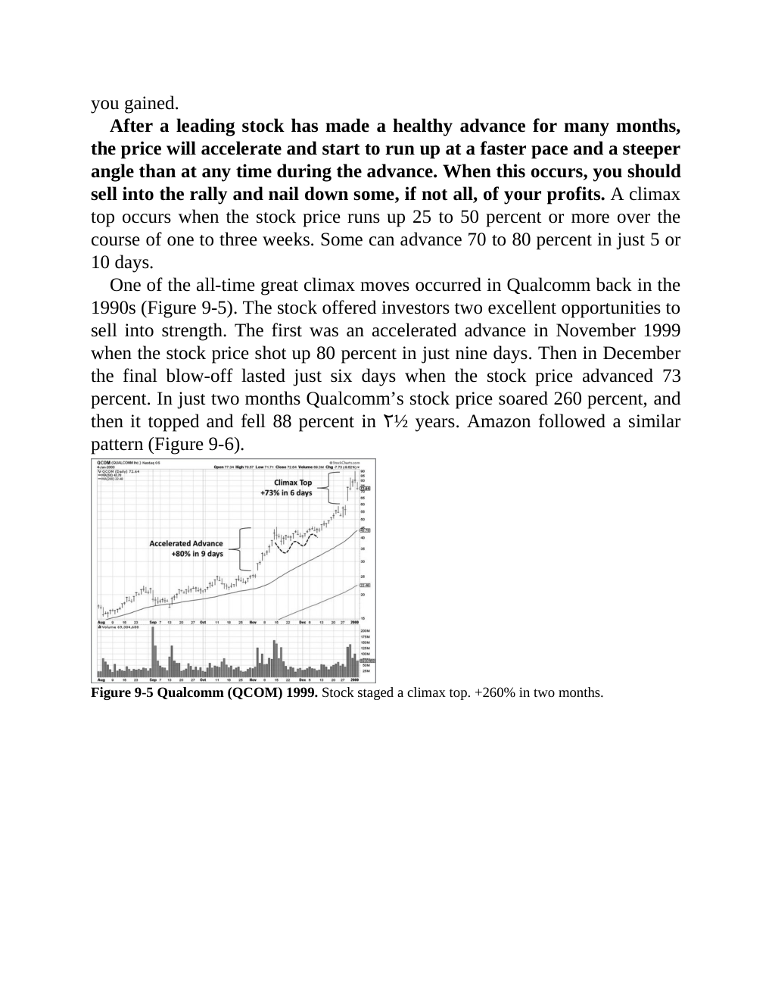

# Think and Trade Like a Champion - Page Image 156

## Source Page

Book: [[Think and Trade Like a Champion]]

## Page Read

Tags: climax-or-exhaustion, sell-or-failure, stage-2-leadership, stock-chart-page, vcp-or-tightening, volume-dry-up

Concepts: [[Pivot and Entry]], [[Relative Strength Leadership]], [[Sell Rules and Failure Signals]], [[Stage 2 Uptrend]], [[Trend Template]], [[Volatility Contraction Pattern]], [[Volume Dry-Up and Accumulation]]

This page contains one or more stock-chart figures already reconciled in the stock-image layer. Study the source page first for the visual lesson, then open the linked case notes to compare it against rebuilt OHLCV data.

## Linked Stock Figures

- [[Think and Trade Like a Champion - Figure 9-5 - QCOM - page 156]] - QCOM - vcp-or-tightening; volume-dry-up; climax-or-exhaustion; stage-2-leadership

## Extracted Page Text Signal

you gained. After a leading stock has made a healthy advance for many months, the price will accelerate and start to run up at a faster pace and a steeper angle than at any time during the advance. When this occurs, you should sell into the rally and nail down some, if not all, of your profits. A climax top occurs when the stock price runs up 25 to 50 percent or more over the course of one to three weeks. Some can advance 70 to 80 percent in just 5 or 10 days. One of the all-time great climax mo...

## Manual Study Prompt

- What visual structure is the page trying to make obvious?
- Is the lesson about buying, avoiding, selling, or managing risk?
- If a ticker is not present, what generic behavior does the image teach?
- If a ticker is present, does the linked OHLCV rebuild confirm the same behavior?
