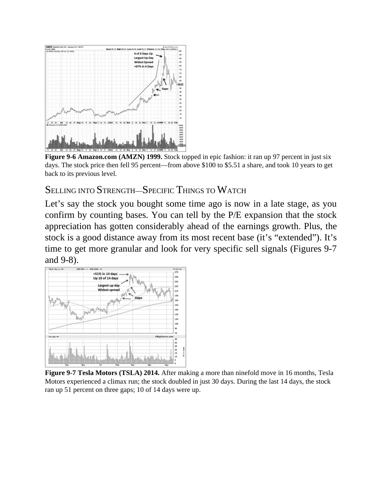

# Think and Trade Like a Champion - Page Image 157

## Source Page

Book: [[Think and Trade Like a Champion]]

## Page Read

Tags: climax-or-exhaustion, sell-or-failure, stage-2-leadership, stock-chart-page, vcp-or-tightening

Concepts: [[Pivot and Entry]], [[Relative Strength Leadership]], [[Sell Rules and Failure Signals]], [[Stage 2 Uptrend]], [[Trend Template]], [[Volatility Contraction Pattern]], [[Volume Dry-Up and Accumulation]]

This page contains one or more stock-chart figures already reconciled in the stock-image layer. Study the source page first for the visual lesson, then open the linked case notes to compare it against rebuilt OHLCV data.

## Linked Stock Figures

- [[Think and Trade Like a Champion - Figure 9-6 - AMZN - page 157]] - AMZN - vcp-or-tightening; stage-2-leadership
- [[Think and Trade Like a Champion - Figure 9-7 - TSLA - page 157]] - TSLA - vcp-or-tightening; climax-or-exhaustion; stage-2-leadership

## Extracted Page Text Signal

Figure 9-6 Amazon.com (AMZN) 1999. Stock topped in epic fashion: it ran up 97 percent in just six days. The stock price then fell 95 percent-from above $100 to $5.51 a share, and took 10 years to get back to its previous level. SELLING INTO STRENGTH-SPECIFIC THINGS TO WATCH Let’s say the stock you bought some time ago is now in a late stage, as you confirm by counting bases. You can tell by the P/E expansion that the stock appreciation has gotten considerably ahead of the earnings growth. Plus, ...

## Manual Study Prompt

- What visual structure is the page trying to make obvious?
- Is the lesson about buying, avoiding, selling, or managing risk?
- If a ticker is not present, what generic behavior does the image teach?
- If a ticker is present, does the linked OHLCV rebuild confirm the same behavior?
