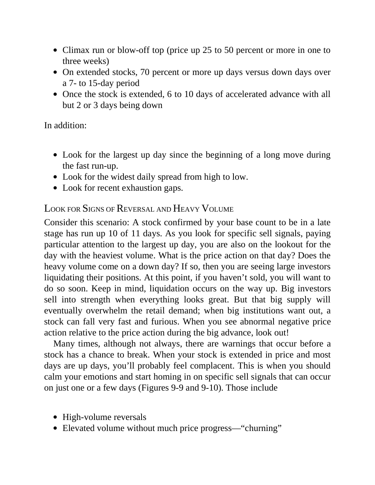

# Think and Trade Like a Champion - Page Image 159

## Source Page

Book: [[Think and Trade Like a Champion]]

## Page Read

Tags: sell-or-failure, text-or-context-page, volume-behavior

Concepts: [[Sell Rules and Failure Signals]], [[Volume Dry-Up and Accumulation]]

This page is mainly text/context. It is included so the image index has complete source coverage, but it should not be treated as an independent chart pattern.

## Linked Stock Figures

- No extracted stock-figure case on this page.

## Extracted Page Text Signal

Climax run or blow-off top (price up 25 to 50 percent or more in one to three weeks) On extended stocks, 70 percent or more up days versus down days over a 7- to 15-day period Once the stock is extended, 6 to 10 days of accelerated advance with all but 2 or 3 days being down In addition: Look for the largest up day since the beginning of a long move during the fast run-up. Look for the widest daily spread from high to low. Look for recent exhaustion gaps. LOOK FOR SIGNS OF REVERSAL AND HEAVY VOL...

## Manual Study Prompt

- What visual structure is the page trying to make obvious?
- Is the lesson about buying, avoiding, selling, or managing risk?
- If a ticker is not present, what generic behavior does the image teach?
- If a ticker is present, does the linked OHLCV rebuild confirm the same behavior?
