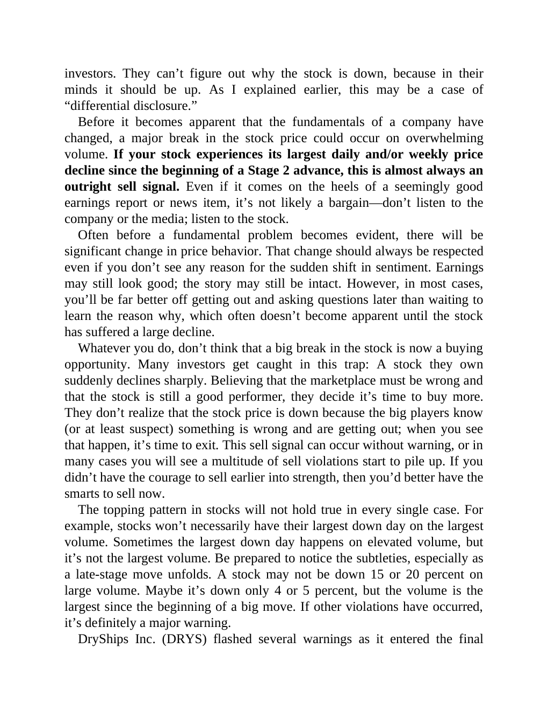

# Think and Trade Like a Champion - Page Image 161

## Source Page

Book: [[Think and Trade Like a Champion]]

## Page Read

Tags: manual-figure-page, sell-or-failure, stage-2-uptrend, volume-behavior

Concepts: [[Mental Discipline]], [[Sell Rules and Failure Signals]], [[Stage 2 Uptrend]], [[Volume Dry-Up and Accumulation]]

This page contains figure language, but the ticker/date was not extractable from the caption text. Treat it as a manual visual case: identify the shape, decide whether it is a buy setup or an avoid/sell lesson, and only promote it to a trade template after a ticker/date can be reconciled.

## Linked Stock Figures

- No extracted stock-figure case on this page.

## Extracted Page Text Signal

investors. They can’t figure out why the stock is down, because in their minds it should be up. As I explained earlier, this may be a case of “differential disclosure.” Before it becomes apparent that the fundamentals of a company have changed, a major break in the stock price could occur on overwhelming volume. If your stock experiences its largest daily and/or weekly price decline since the beginning of a Stage 2 advance, this is almost always an outright sell signal. Even if it comes on the h...

## Manual Study Prompt

- What visual structure is the page trying to make obvious?
- Is the lesson about buying, avoiding, selling, or managing risk?
- If a ticker is not present, what generic behavior does the image teach?
- If a ticker is present, does the linked OHLCV rebuild confirm the same behavior?
