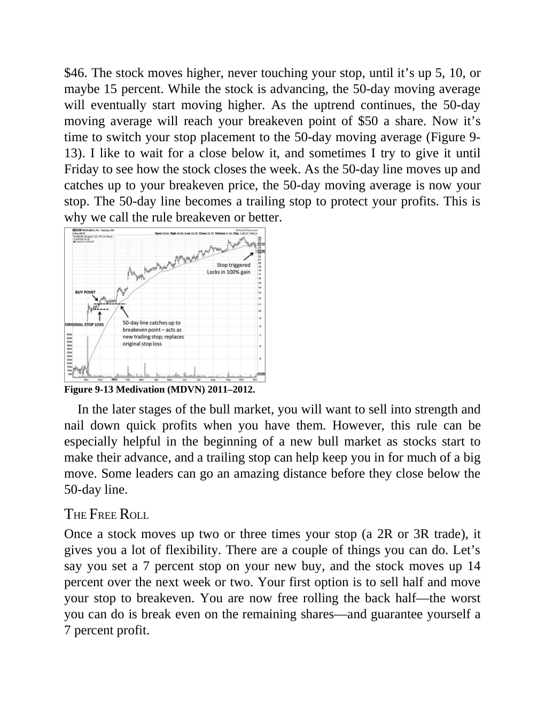

# Think and Trade Like a Champion - Page Image 163

## Source Page

Book: [[Think and Trade Like a Champion]]

## Page Read

Tags: manual-review-needed, risk-first, sell-or-failure, stock-chart-page

Concepts: [[Mental Discipline]], [[Risk First]], [[Sell Rules and Failure Signals]]

This page contains one or more stock-chart figures already reconciled in the stock-image layer. Study the source page first for the visual lesson, then open the linked case notes to compare it against rebuilt OHLCV data.

## Linked Stock Figures

- [[Think and Trade Like a Champion - Figure 9-13 - MDVN - page 163]] - MDVN - manual-review-needed

## Extracted Page Text Signal

$46. The stock moves higher, never touching your stop, until it’s up 5, 10, or maybe 15 percent. While the stock is advancing, the 50-day moving average will eventually start moving higher. As the uptrend continues, the 50-day moving average will reach your breakeven point of $50 a share. Now it’s time to switch your stop placement to the 50-day moving average (Figure 9- 13). I like to wait for a close below it, and sometimes I try to give it until Friday to see how the stock closes the week. As...

## Manual Study Prompt

- What visual structure is the page trying to make obvious?
- Is the lesson about buying, avoiding, selling, or managing risk?
- If a ticker is not present, what generic behavior does the image teach?
- If a ticker is present, does the linked OHLCV rebuild confirm the same behavior?
