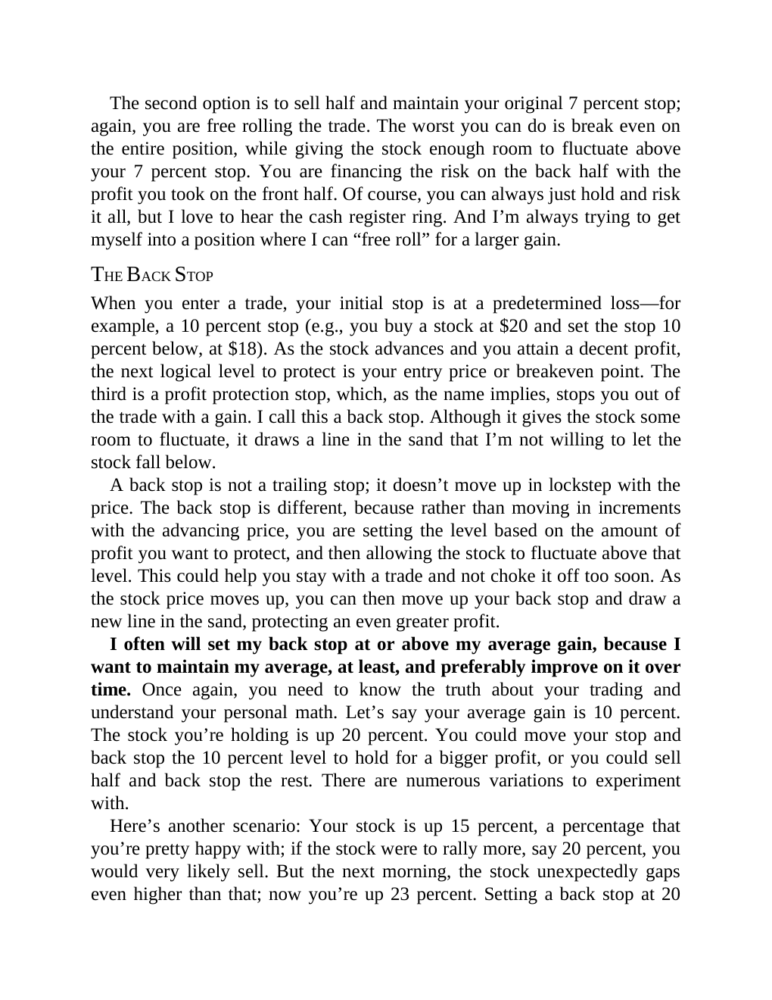

# Think and Trade Like a Champion - Page Image 164

## Source Page

Book: [[Think and Trade Like a Champion]]

## Page Read

Tags: risk-first, sell-or-failure, text-or-context-page

Concepts: [[Risk First]], [[Sell Rules and Failure Signals]]

This page is mainly text/context. It is included so the image index has complete source coverage, but it should not be treated as an independent chart pattern.

## Linked Stock Figures

- No extracted stock-figure case on this page.

## Extracted Page Text Signal

The second option is to sell half and maintain your original 7 percent stop; again, you are free rolling the trade. The worst you can do is break even on the entire position, while giving the stock enough room to fluctuate above your 7 percent stop. You are financing the risk on the back half with the profit you took on the front half. Of course, you can always just hold and risk it all, but I love to hear the cash register ring. And I’m always trying to get myself into a position where I can “f...

## Manual Study Prompt

- What visual structure is the page trying to make obvious?
- Is the lesson about buying, avoiding, selling, or managing risk?
- If a ticker is not present, what generic behavior does the image teach?
- If a ticker is present, does the linked OHLCV rebuild confirm the same behavior?
