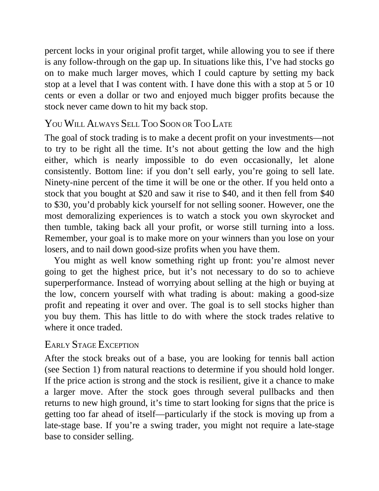

# Think and Trade Like a Champion - Page Image 165

## Source Page

Book: [[Think and Trade Like a Champion]]

## Page Read

Tags: risk-first, sell-or-failure, text-or-context-page

Concepts: [[Risk First]], [[Sell Rules and Failure Signals]]

This page is mainly text/context. It is included so the image index has complete source coverage, but it should not be treated as an independent chart pattern.

## Linked Stock Figures

- No extracted stock-figure case on this page.

## Extracted Page Text Signal

percent locks in your original profit target, while allowing you to see if there is any follow-through on the gap up. In situations like this, I’ve had stocks go on to make much larger moves, which I could capture by setting my back stop at a level that I was content with. I have done this with a stop at 5 or 10 cents or even a dollar or two and enjoyed much bigger profits because the stock never came down to hit my back stop. YOU WILL ALWAYS SELL TOO SOON OR TOO LATE The goal of stock trading i...

## Manual Study Prompt

- What visual structure is the page trying to make obvious?
- Is the lesson about buying, avoiding, selling, or managing risk?
- If a ticker is not present, what generic behavior does the image teach?
- If a ticker is present, does the linked OHLCV rebuild confirm the same behavior?
