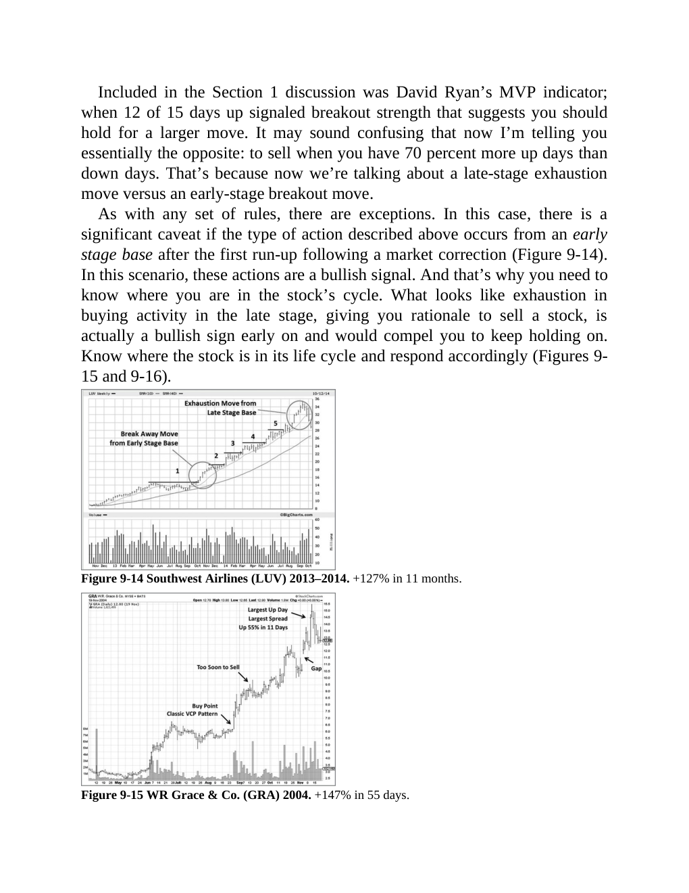

# Think and Trade Like a Champion - Page Image 166

## Source Page

Book: [[Think and Trade Like a Champion]]

## Page Read

Tags: manual-review-needed, pivot-or-entry, sell-or-failure, stage-2-leadership, stock-chart-page, vcp-or-tightening

Concepts: [[Mental Discipline]], [[Pivot and Entry]], [[Relative Strength Leadership]], [[Sell Rules and Failure Signals]], [[Stage 2 Uptrend]], [[Trend Template]], [[Volatility Contraction Pattern]], [[Volume Dry-Up and Accumulation]]

This page contains one or more stock-chart figures already reconciled in the stock-image layer. Study the source page first for the visual lesson, then open the linked case notes to compare it against rebuilt OHLCV data.

## Linked Stock Figures

- [[Think and Trade Like a Champion - Figure 9-14 - LUV - page 166]] - LUV - vcp-or-tightening; stage-2-leadership
- [[Think and Trade Like a Champion - Figure 9-15 - GRA - page 166]] - GRA - manual-review-needed

## Extracted Page Text Signal

Included in the Section 1 discussion was David Ryan’s MVP indicator; when 12 of 15 days up signaled breakout strength that suggests you should hold for a larger move. It may sound confusing that now I’m telling you essentially the opposite: to sell when you have 70 percent more up days than down days. That’s because now we’re talking about a late-stage exhaustion move versus an early-stage breakout move. As with any set of rules, there are exceptions. In this case, there is a significant caveat ...

## Manual Study Prompt

- What visual structure is the page trying to make obvious?
- Is the lesson about buying, avoiding, selling, or managing risk?
- If a ticker is not present, what generic behavior does the image teach?
- If a ticker is present, does the linked OHLCV rebuild confirm the same behavior?
