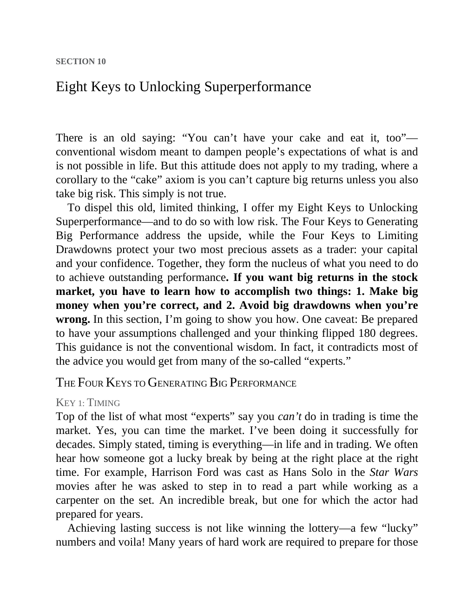

# Think and Trade Like a Champion - Page Image 168

## Source Page

Book: [[Think and Trade Like a Champion]]

## Page Read

Tags: risk-first, text-or-context-page

Concepts: [[Risk First]]

This page is mainly text/context. It is included so the image index has complete source coverage, but it should not be treated as an independent chart pattern.

## Linked Stock Figures

- No extracted stock-figure case on this page.

## Extracted Page Text Signal

SECTION 10 Eight Keys to Unlocking Superperformance There is an old saying: “You can’t have your cake and eat it, too”- conventional wisdom meant to dampen people’s expectations of what is and is not possible in life. But this attitude does not apply to my trading, where a corollary to the “cake” axiom is you can’t capture big returns unless you also take big risk. This simply is not true. To dispel this old, limited thinking, I offer my Eight Keys to Unlocking Superperformance-and to do so with...

## Manual Study Prompt

- What visual structure is the page trying to make obvious?
- Is the lesson about buying, avoiding, selling, or managing risk?
- If a ticker is not present, what generic behavior does the image teach?
- If a ticker is present, does the linked OHLCV rebuild confirm the same behavior?
