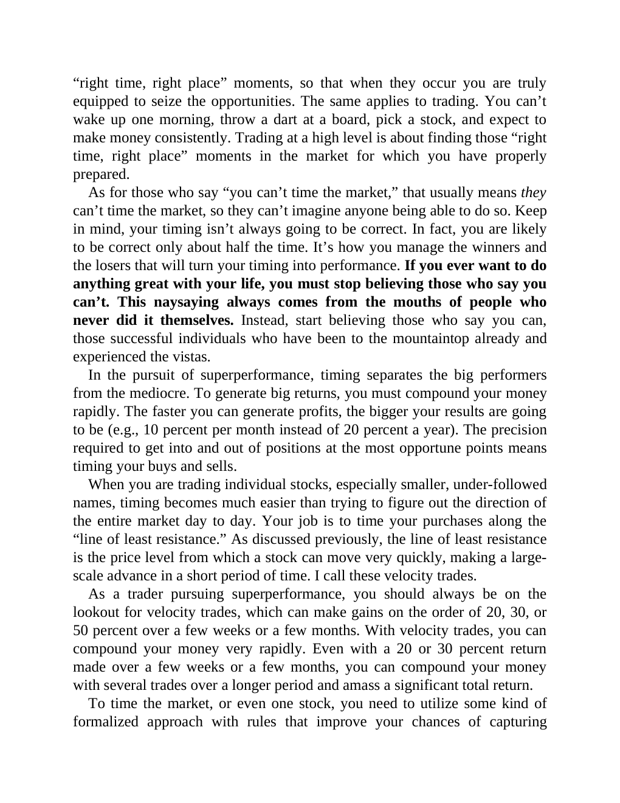

# Think and Trade Like a Champion - Page Image 169

## Source Page

Book: [[Think and Trade Like a Champion]]

## Page Read

Tags: risk-first, sell-or-failure, text-or-context-page

Concepts: [[Risk First]], [[Sell Rules and Failure Signals]]

This page is mainly text/context. It is included so the image index has complete source coverage, but it should not be treated as an independent chart pattern.

## Linked Stock Figures

- No extracted stock-figure case on this page.

## Extracted Page Text Signal

“right time, right place” moments, so that when they occur you are truly equipped to seize the opportunities. The same applies to trading. You can’t wake up one morning, throw a dart at a board, pick a stock, and expect to make money consistently. Trading at a high level is about finding those “right time, right place” moments in the market for which you have properly prepared. As for those who say “you can’t time the market,” that usually means they can’t time the market, so they can’t imagine ...

## Manual Study Prompt

- What visual structure is the page trying to make obvious?
- Is the lesson about buying, avoiding, selling, or managing risk?
- If a ticker is not present, what generic behavior does the image teach?
- If a ticker is present, does the linked OHLCV rebuild confirm the same behavior?
