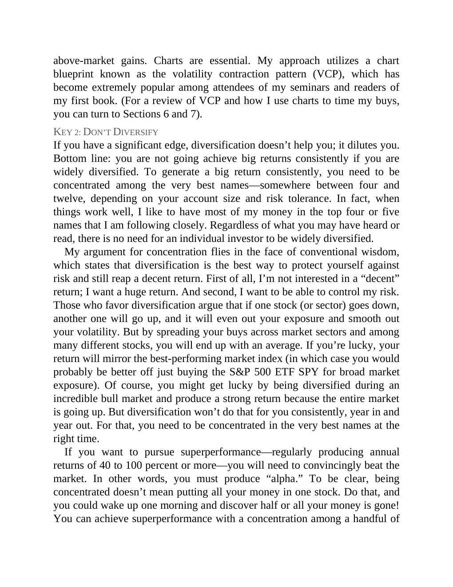

# Think and Trade Like a Champion - Page Image 170

## Source Page

Book: [[Think and Trade Like a Champion]]

## Page Read

Tags: risk-first, text-or-context-page, vcp-or-tightening

Concepts: [[Risk First]], [[Volatility Contraction Pattern]]

This page is mainly text/context. It is included so the image index has complete source coverage, but it should not be treated as an independent chart pattern.

## Linked Stock Figures

- No extracted stock-figure case on this page.

## Extracted Page Text Signal

above-market gains. Charts are essential. My approach utilizes a chart blueprint known as the volatility contraction pattern (VCP), which has become extremely popular among attendees of my seminars and readers of my first book. (For a review of VCP and how I use charts to time my buys, you can turn to Sections 6 and 7). KEY 2: DON’T DIVERSIFY If you have a significant edge, diversification doesn’t help you; it dilutes you. Bottom line: you are not going achieve big returns consistently if you ar...

## Manual Study Prompt

- What visual structure is the page trying to make obvious?
- Is the lesson about buying, avoiding, selling, or managing risk?
- If a ticker is not present, what generic behavior does the image teach?
- If a ticker is present, does the linked OHLCV rebuild confirm the same behavior?
