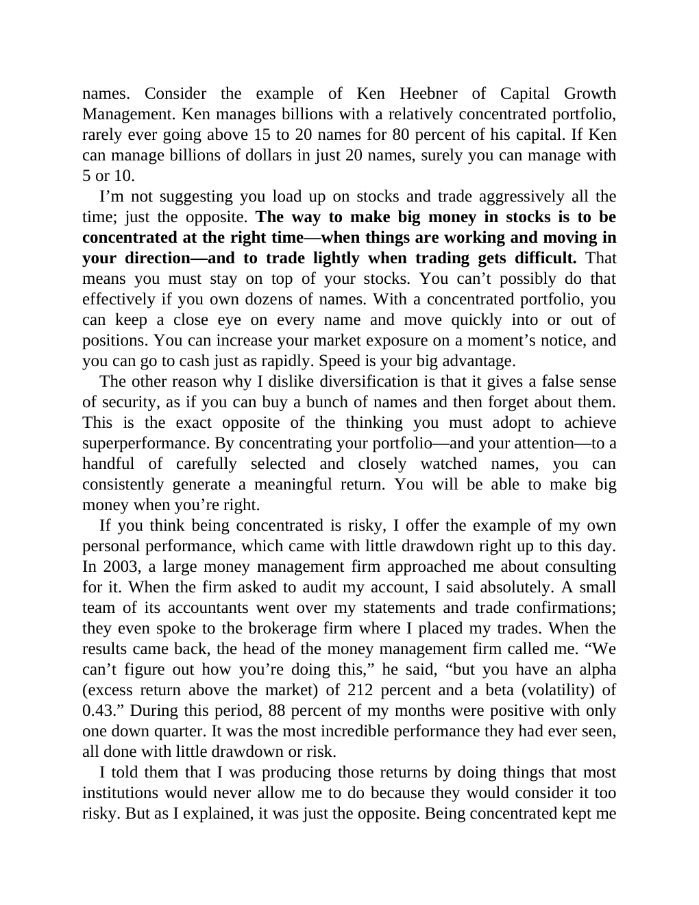

# Think and Trade Like a Champion - Page Image 171

## Source Page

Book: [[Think and Trade Like a Champion]]

## Page Read

Tags: risk-first, text-or-context-page

Concepts: [[Risk First]]

This page is mainly text/context. It is included so the image index has complete source coverage, but it should not be treated as an independent chart pattern.

## Linked Stock Figures

- No extracted stock-figure case on this page.

## Extracted Page Text Signal

names. Consider the example of Ken Heebner of Capital Growth Management. Ken manages billions with a relatively concentrated portfolio, rarely ever going above 15 to 20 names for 80 percent of his capital. If Ken can manage billions of dollars in just 20 names, surely you can manage with 5 or 10. I’m not suggesting you load up on stocks and trade aggressively all the time; just the opposite. The way to make big money in stocks is to be concentrated at the right time-when things are working and m...

## Manual Study Prompt

- What visual structure is the page trying to make obvious?
- Is the lesson about buying, avoiding, selling, or managing risk?
- If a ticker is not present, what generic behavior does the image teach?
- If a ticker is present, does the linked OHLCV rebuild confirm the same behavior?
