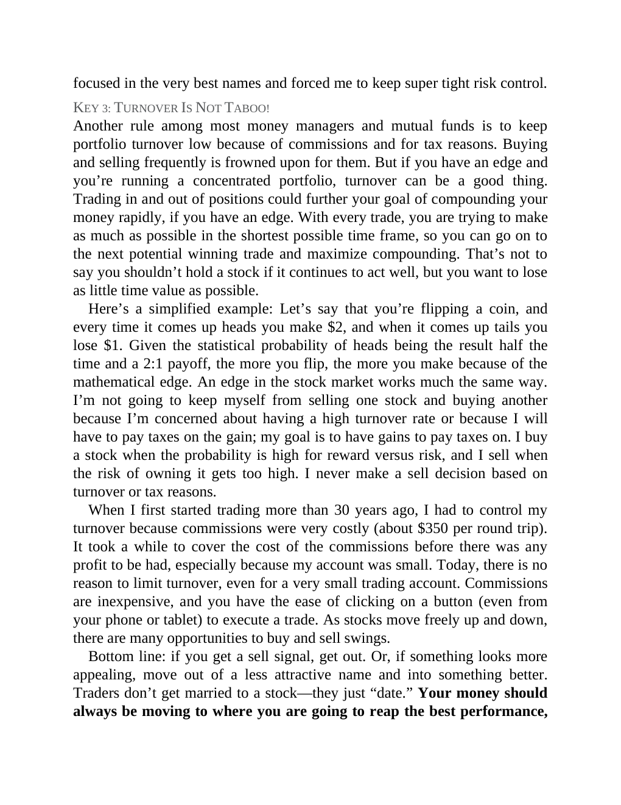

# Think and Trade Like a Champion - Page Image 172

## Source Page

Book: [[Think and Trade Like a Champion]]

## Page Read

Tags: risk-first, sell-or-failure, text-or-context-page

Concepts: [[Risk First]], [[Sell Rules and Failure Signals]]

This page is mainly text/context. It is included so the image index has complete source coverage, but it should not be treated as an independent chart pattern.

## Linked Stock Figures

- No extracted stock-figure case on this page.

## Extracted Page Text Signal

focused in the very best names and forced me to keep super tight risk control. KEY 3: TURNOVER IS NOT TABOO! Another rule among most money managers and mutual funds is to keep portfolio turnover low because of commissions and for tax reasons. Buying and selling frequently is frowned upon for them. But if you have an edge and you’re running a concentrated portfolio, turnover can be a good thing. Trading in and out of positions could further your goal of compounding your money rapidly, if you have...

## Manual Study Prompt

- What visual structure is the page trying to make obvious?
- Is the lesson about buying, avoiding, selling, or managing risk?
- If a ticker is not present, what generic behavior does the image teach?
- If a ticker is present, does the linked OHLCV rebuild confirm the same behavior?
