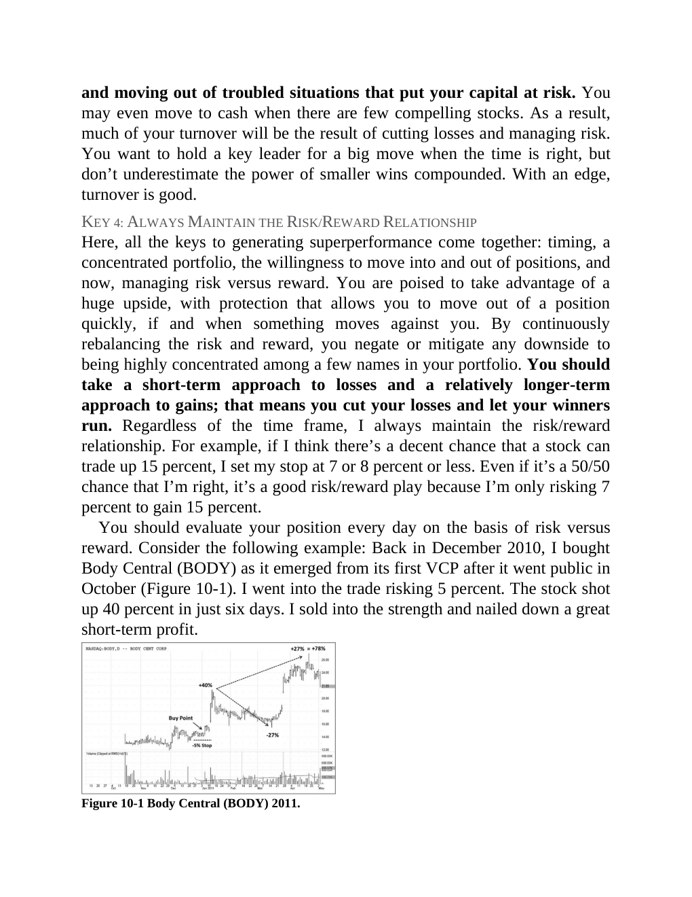

# Think and Trade Like a Champion - Page Image 173

## Source Page

Book: [[Think and Trade Like a Champion]]

## Page Read

Tags: manual-review-needed, risk-first, stock-chart-page

Concepts: [[Mental Discipline]], [[Risk First]]

This page contains one or more stock-chart figures already reconciled in the stock-image layer. Study the source page first for the visual lesson, then open the linked case notes to compare it against rebuilt OHLCV data.

## Linked Stock Figures

- [[Think and Trade Like a Champion - Figure 10-1 - BODY - page 173]] - BODY - manual-review-needed

## Extracted Page Text Signal

and moving out of troubled situations that put your capital at risk. You may even move to cash when there are few compelling stocks. As a result, much of your turnover will be the result of cutting losses and managing risk. You want to hold a key leader for a big move when the time is right, but don’t underestimate the power of smaller wins compounded. With an edge, turnover is good. KEY 4: ALWAYS MAINTAIN THE RISK/REWARD RELATIONSHIP Here, all the keys to generating superperformance come togeth...

## Manual Study Prompt

- What visual structure is the page trying to make obvious?
- Is the lesson about buying, avoiding, selling, or managing risk?
- If a ticker is not present, what generic behavior does the image teach?
- If a ticker is present, does the linked OHLCV rebuild confirm the same behavior?
