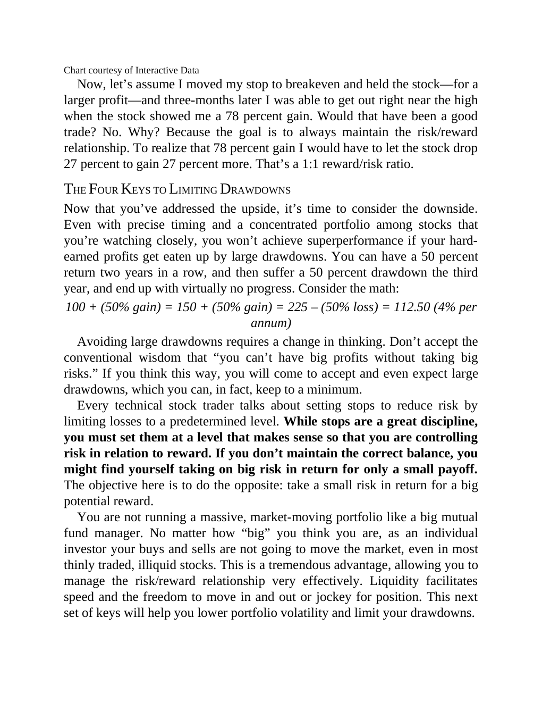

# Think and Trade Like a Champion - Page Image 174

## Source Page

Book: [[Think and Trade Like a Champion]]

## Page Read

Tags: mental-discipline, risk-first, text-or-context-page

Concepts: [[Mental Discipline]], [[Risk First]]

This page is mainly text/context. It is included so the image index has complete source coverage, but it should not be treated as an independent chart pattern.

## Linked Stock Figures

- No extracted stock-figure case on this page.

## Extracted Page Text Signal

Chart courtesy of Interactive Data Now, let’s assume I moved my stop to breakeven and held the stock-for a larger profit-and three-months later I was able to get out right near the high when the stock showed me a 78 percent gain. Would that have been a good trade? No. Why? Because the goal is to always maintain the risk/reward relationship. To realize that 78 percent gain I would have to let the stock drop 27 percent to gain 27 percent more. That’s a 1:1 reward/risk ratio. THE FOUR KEYS TO LIMIT...

## Manual Study Prompt

- What visual structure is the page trying to make obvious?
- Is the lesson about buying, avoiding, selling, or managing risk?
- If a ticker is not present, what generic behavior does the image teach?
- If a ticker is present, does the linked OHLCV rebuild confirm the same behavior?
