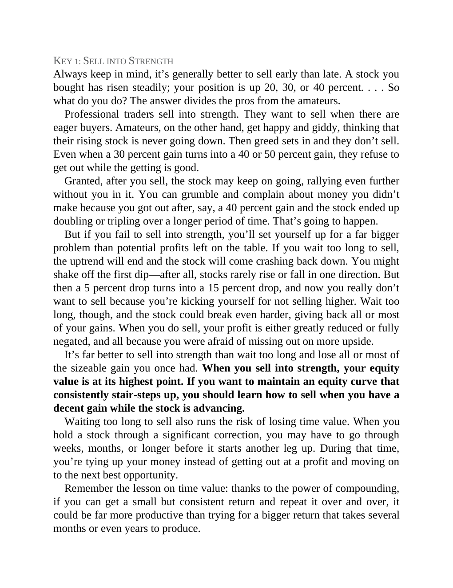

# Think and Trade Like a Champion - Page Image 175

## Source Page

Book: [[Think and Trade Like a Champion]]

## Page Read

Tags: sell-or-failure, text-or-context-page

Concepts: [[Sell Rules and Failure Signals]]

This page is mainly text/context. It is included so the image index has complete source coverage, but it should not be treated as an independent chart pattern.

## Linked Stock Figures

- No extracted stock-figure case on this page.

## Extracted Page Text Signal

KEY 1: SELL INTO STRENGTH Always keep in mind, it’s generally better to sell early than late. A stock you bought has risen steadily; your position is up 20, 30, or 40 percent. . . . So what do you do? The answer divides the pros from the amateurs. Professional traders sell into strength. They want to sell when there are eager buyers. Amateurs, on the other hand, get happy and giddy, thinking that their rising stock is never going down. Then greed sets in and they don’t sell. Even when a 30 perce...

## Manual Study Prompt

- What visual structure is the page trying to make obvious?
- Is the lesson about buying, avoiding, selling, or managing risk?
- If a ticker is not present, what generic behavior does the image teach?
- If a ticker is present, does the linked OHLCV rebuild confirm the same behavior?
