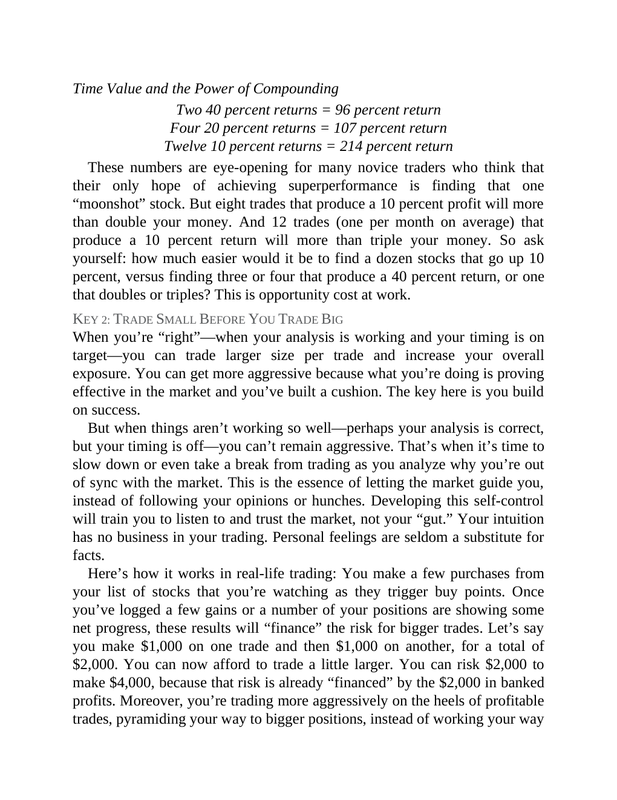

# Think and Trade Like a Champion - Page Image 176

## Source Page

Book: [[Think and Trade Like a Champion]]

## Page Read

Tags: text-or-context-page

Concepts: [[Mental Discipline]]

This page is mainly text/context. It is included so the image index has complete source coverage, but it should not be treated as an independent chart pattern.

## Linked Stock Figures

- No extracted stock-figure case on this page.

## Extracted Page Text Signal

Time Value and the Power of Compounding Two 40 percent returns = 96 percent return Four 20 percent returns = 107 percent return Twelve 10 percent returns = 214 percent return These numbers are eye-opening for many novice traders who think that their only hope of achieving superperformance is finding that one “moonshot” stock. But eight trades that produce a 10 percent profit will more than double your money. And 12 trades (one per month on average) that produce a 10 percent return will more than...

## Manual Study Prompt

- What visual structure is the page trying to make obvious?
- Is the lesson about buying, avoiding, selling, or managing risk?
- If a ticker is not present, what generic behavior does the image teach?
- If a ticker is present, does the linked OHLCV rebuild confirm the same behavior?
