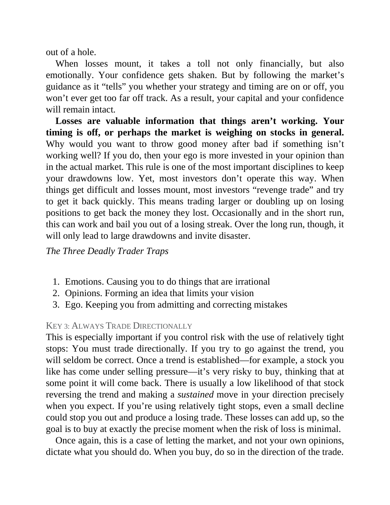

# Think and Trade Like a Champion - Page Image 177

## Source Page

Book: [[Think and Trade Like a Champion]]

## Page Read

Tags: mental-discipline, risk-first, text-or-context-page

Concepts: [[Mental Discipline]], [[Risk First]]

This page is mainly text/context. It is included so the image index has complete source coverage, but it should not be treated as an independent chart pattern.

## Linked Stock Figures

- No extracted stock-figure case on this page.

## Extracted Page Text Signal

out of a hole. When losses mount, it takes a toll not only financially, but also emotionally. Your confidence gets shaken. But by following the market’s guidance as it “tells” you whether your strategy and timing are on or off, you won’t ever get too far off track. As a result, your capital and your confidence will remain intact. Losses are valuable information that things aren’t working. Your timing is off, or perhaps the market is weighing on stocks in general. Why would you want to throw good...

## Manual Study Prompt

- What visual structure is the page trying to make obvious?
- Is the lesson about buying, avoiding, selling, or managing risk?
- If a ticker is not present, what generic behavior does the image teach?
- If a ticker is present, does the linked OHLCV rebuild confirm the same behavior?
