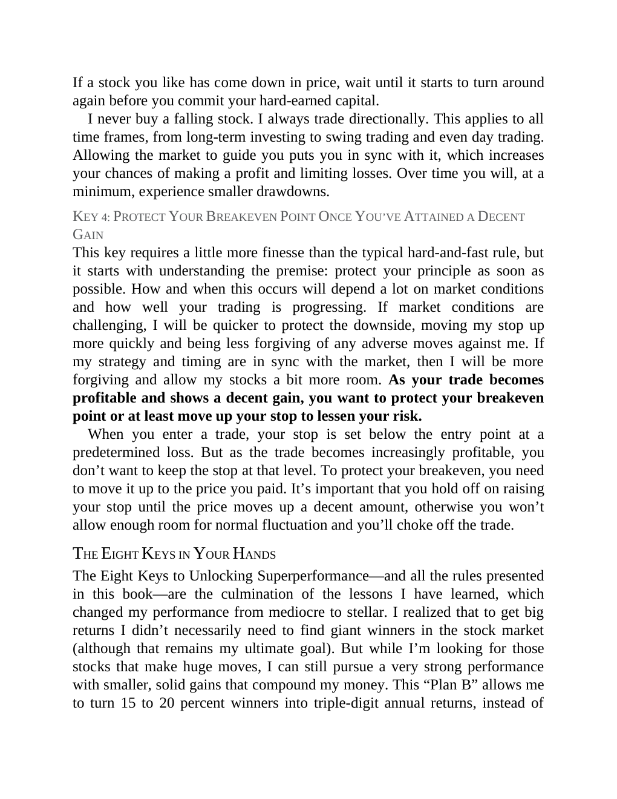

# Think and Trade Like a Champion - Page Image 178

## Source Page

Book: [[Think and Trade Like a Champion]]

## Page Read

Tags: risk-first, text-or-context-page

Concepts: [[Risk First]]

This page is mainly text/context. It is included so the image index has complete source coverage, but it should not be treated as an independent chart pattern.

## Linked Stock Figures

- No extracted stock-figure case on this page.

## Extracted Page Text Signal

If a stock you like has come down in price, wait until it starts to turn around again before you commit your hard-earned capital. I never buy a falling stock. I always trade directionally. This applies to all time frames, from long-term investing to swing trading and even day trading. Allowing the market to guide you puts you in sync with it, which increases your chances of making a profit and limiting losses. Over time you will, at a minimum, experience smaller drawdowns. KEY 4: PROTECT YOUR BR...

## Manual Study Prompt

- What visual structure is the page trying to make obvious?
- Is the lesson about buying, avoiding, selling, or managing risk?
- If a ticker is not present, what generic behavior does the image teach?
- If a ticker is present, does the linked OHLCV rebuild confirm the same behavior?
