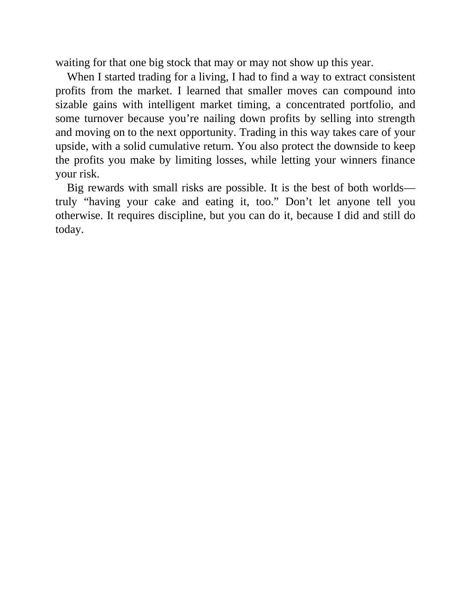

# Think and Trade Like a Champion - Page Image 179

## Source Page

Book: [[Think and Trade Like a Champion]]

## Page Read

Tags: mental-discipline, risk-first, sell-or-failure, text-or-context-page

Concepts: [[Mental Discipline]], [[Risk First]], [[Sell Rules and Failure Signals]]

This page is mainly text/context. It is included so the image index has complete source coverage, but it should not be treated as an independent chart pattern.

## Linked Stock Figures

- No extracted stock-figure case on this page.

## Extracted Page Text Signal

waiting for that one big stock that may or may not show up this year. When I started trading for a living, I had to find a way to extract consistent profits from the market. I learned that smaller moves can compound into sizable gains with intelligent market timing, a concentrated portfolio, and some turnover because you’re nailing down profits by selling into strength and moving on to the next opportunity. Trading in this way takes care of your upside, with a solid cumulative return. You also p...

## Manual Study Prompt

- What visual structure is the page trying to make obvious?
- Is the lesson about buying, avoiding, selling, or managing risk?
- If a ticker is not present, what generic behavior does the image teach?
- If a ticker is present, does the linked OHLCV rebuild confirm the same behavior?
