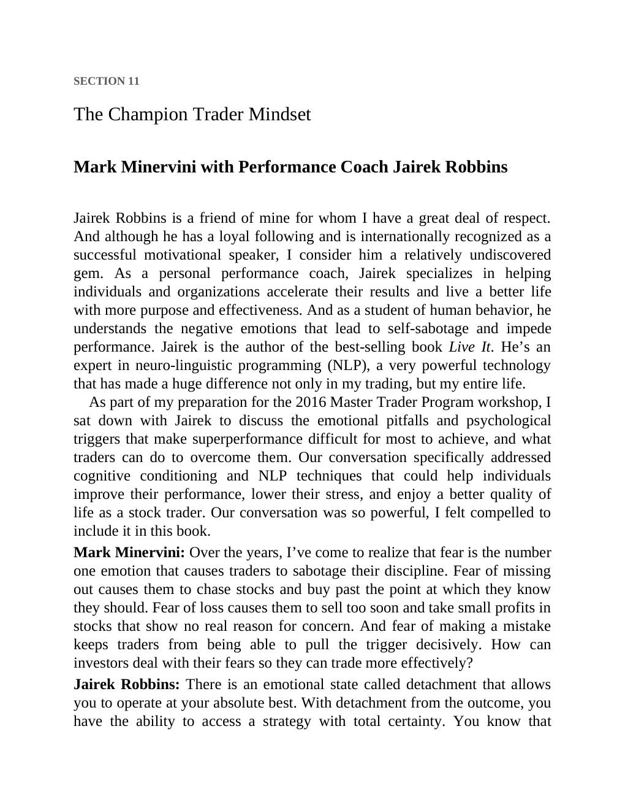

# Think and Trade Like a Champion - Page Image 180

## Source Page

Book: [[Think and Trade Like a Champion]]

## Page Read

Tags: mental-discipline, sell-or-failure, text-or-context-page

Concepts: [[Mental Discipline]], [[Sell Rules and Failure Signals]]

This page is mainly text/context. It is included so the image index has complete source coverage, but it should not be treated as an independent chart pattern.

## Linked Stock Figures

- No extracted stock-figure case on this page.

## Extracted Page Text Signal

SECTION 11 The Champion Trader Mindset Mark Minervini with Performance Coach Jairek Robbins Jairek Robbins is a friend of mine for whom I have a great deal of respect. And although he has a loyal following and is internationally recognized as a successful motivational speaker, I consider him a relatively undiscovered gem. As a personal performance coach, Jairek specializes in helping individuals and organizations accelerate their results and live a better life with more purpose and effectiveness...

## Manual Study Prompt

- What visual structure is the page trying to make obvious?
- Is the lesson about buying, avoiding, selling, or managing risk?
- If a ticker is not present, what generic behavior does the image teach?
- If a ticker is present, does the linked OHLCV rebuild confirm the same behavior?
