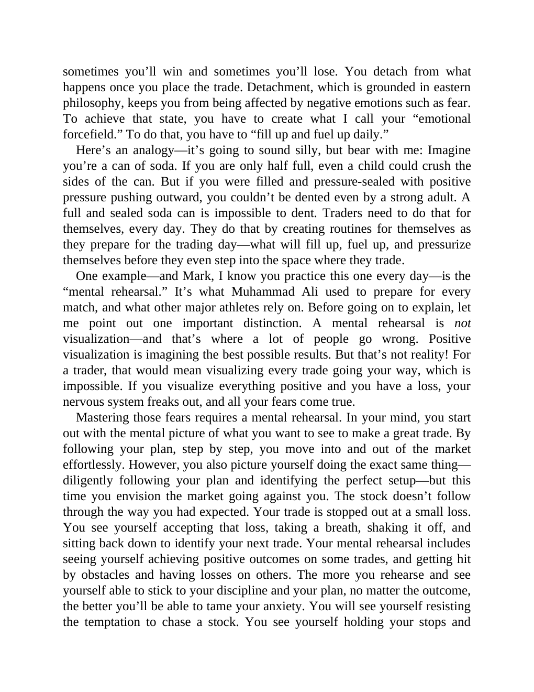

# Think and Trade Like a Champion - Page Image 181

## Source Page

Book: [[Think and Trade Like a Champion]]

## Page Read

Tags: text-or-context-page

Concepts: [[Mental Discipline]]

This page is mainly text/context. It is included so the image index has complete source coverage, but it should not be treated as an independent chart pattern.

## Linked Stock Figures

- No extracted stock-figure case on this page.

## Extracted Page Text Signal

sometimes you’ll win and sometimes you’ll lose. You detach from what happens once you place the trade. Detachment, which is grounded in eastern philosophy, keeps you from being affected by negative emotions such as fear. To achieve that state, you have to create what I call your “emotional forcefield.” To do that, you have to “fill up and fuel up daily.” Here’s an analogy-it’s going to sound silly, but bear with me: Imagine you’re a can of soda. If you are only half full, even a child could crus...

## Manual Study Prompt

- What visual structure is the page trying to make obvious?
- Is the lesson about buying, avoiding, selling, or managing risk?
- If a ticker is not present, what generic behavior does the image teach?
- If a ticker is present, does the linked OHLCV rebuild confirm the same behavior?
