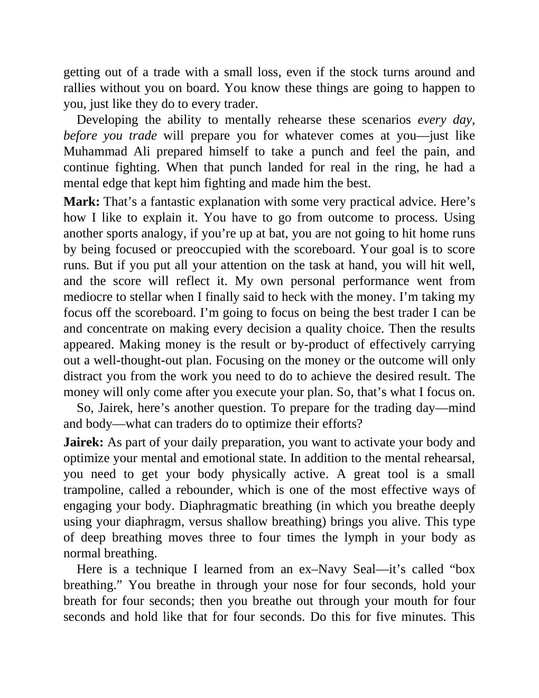

# Think and Trade Like a Champion - Page Image 182

## Source Page

Book: [[Think and Trade Like a Champion]]

## Page Read

Tags: text-or-context-page

Concepts: [[Mental Discipline]]

This page is mainly text/context. It is included so the image index has complete source coverage, but it should not be treated as an independent chart pattern.

## Linked Stock Figures

- No extracted stock-figure case on this page.

## Extracted Page Text Signal

getting out of a trade with a small loss, even if the stock turns around and rallies without you on board. You know these things are going to happen to you, just like they do to every trader. Developing the ability to mentally rehearse these scenarios every day, before you trade will prepare you for whatever comes at you-just like Muhammad Ali prepared himself to take a punch and feel the pain, and continue fighting. When that punch landed for real in the ring, he had a mental edge that kept him...

## Manual Study Prompt

- What visual structure is the page trying to make obvious?
- Is the lesson about buying, avoiding, selling, or managing risk?
- If a ticker is not present, what generic behavior does the image teach?
- If a ticker is present, does the linked OHLCV rebuild confirm the same behavior?
