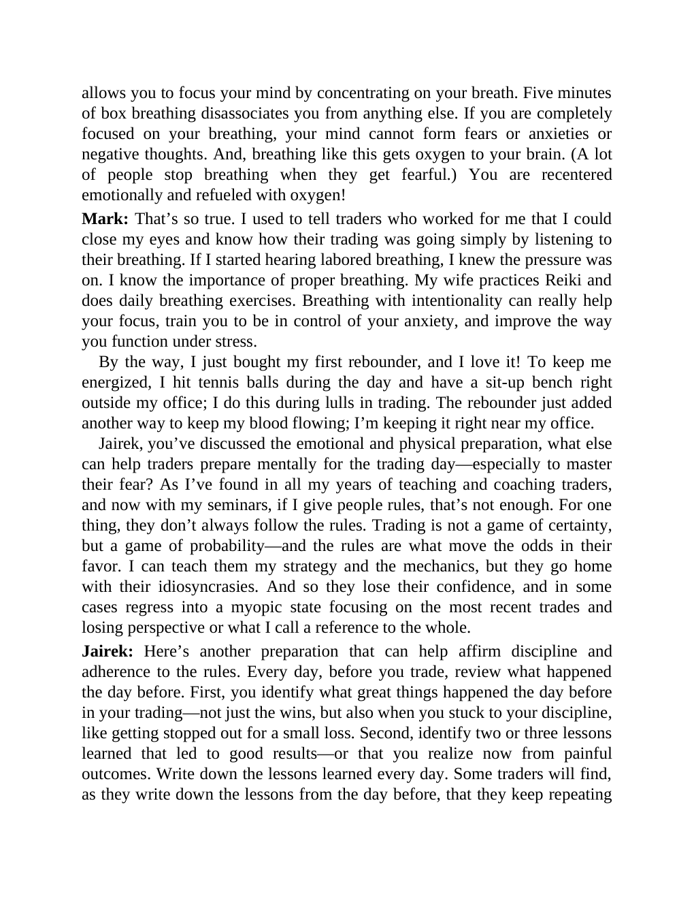

# Think and Trade Like a Champion - Page Image 183

## Source Page

Book: [[Think and Trade Like a Champion]]

## Page Read

Tags: risk-first, text-or-context-page

Concepts: [[Risk First]]

This page is mainly text/context. It is included so the image index has complete source coverage, but it should not be treated as an independent chart pattern.

## Linked Stock Figures

- No extracted stock-figure case on this page.

## Extracted Page Text Signal

allows you to focus your mind by concentrating on your breath. Five minutes of box breathing disassociates you from anything else. If you are completely focused on your breathing, your mind cannot form fears or anxieties or negative thoughts. And, breathing like this gets oxygen to your brain. (A lot of people stop breathing when they get fearful.) You are recentered emotionally and refueled with oxygen! Mark: That’s so true. I used to tell traders who worked for me that I could close my eyes an...

## Manual Study Prompt

- What visual structure is the page trying to make obvious?
- Is the lesson about buying, avoiding, selling, or managing risk?
- If a ticker is not present, what generic behavior does the image teach?
- If a ticker is present, does the linked OHLCV rebuild confirm the same behavior?
