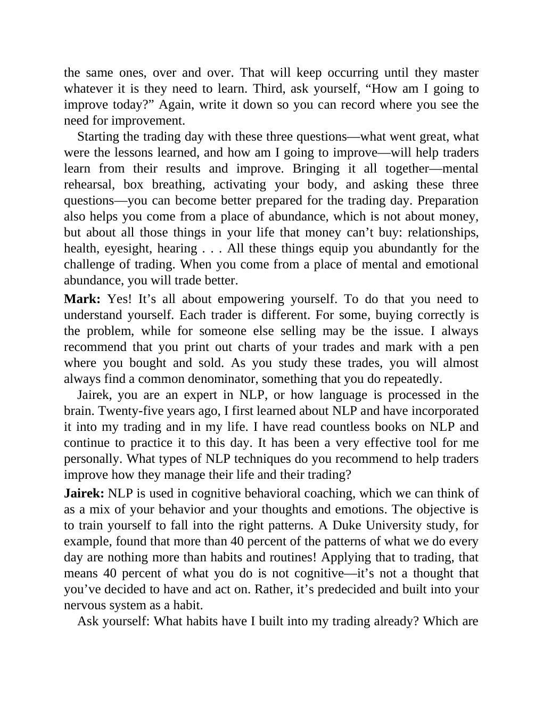

# Think and Trade Like a Champion - Page Image 184

## Source Page

Book: [[Think and Trade Like a Champion]]

## Page Read

Tags: sell-or-failure, text-or-context-page

Concepts: [[Sell Rules and Failure Signals]]

This page is mainly text/context. It is included so the image index has complete source coverage, but it should not be treated as an independent chart pattern.

## Linked Stock Figures

- No extracted stock-figure case on this page.

## Extracted Page Text Signal

the same ones, over and over. That will keep occurring until they master whatever it is they need to learn. Third, ask yourself, “How am I going to improve today?” Again, write it down so you can record where you see the need for improvement. Starting the trading day with these three questions-what went great, what were the lessons learned, and how am I going to improve-will help traders learn from their results and improve. Bringing it all together-mental rehearsal, box breathing, activating yo...

## Manual Study Prompt

- What visual structure is the page trying to make obvious?
- Is the lesson about buying, avoiding, selling, or managing risk?
- If a ticker is not present, what generic behavior does the image teach?
- If a ticker is present, does the linked OHLCV rebuild confirm the same behavior?
