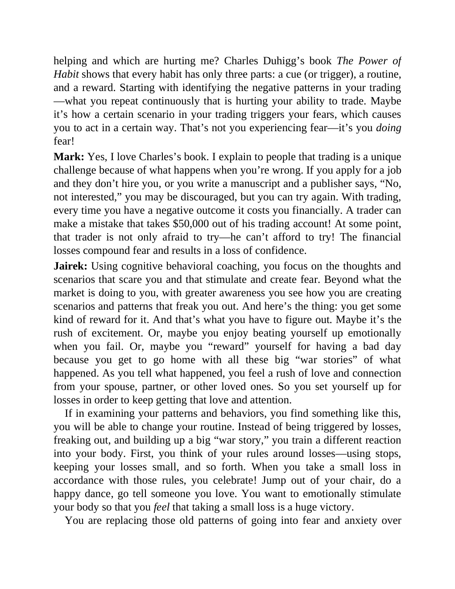

# Think and Trade Like a Champion - Page Image 185

## Source Page

Book: [[Think and Trade Like a Champion]]

## Page Read

Tags: manual-figure-page, mental-discipline

Concepts: [[Mental Discipline]]

This page contains figure language, but the ticker/date was not extractable from the caption text. Treat it as a manual visual case: identify the shape, decide whether it is a buy setup or an avoid/sell lesson, and only promote it to a trade template after a ticker/date can be reconciled.

## Linked Stock Figures

- No extracted stock-figure case on this page.

## Extracted Page Text Signal

helping and which are hurting me? Charles Duhigg’s book The Power of Habit shows that every habit has only three parts: a cue (or trigger), a routine, and a reward. Starting with identifying the negative patterns in your trading -what you repeat continuously that is hurting your ability to trade. Maybe it’s how a certain scenario in your trading triggers your fears, which causes you to act in a certain way. That’s not you experiencing fear-it’s you doing fear! Mark: Yes, I love Charles’s book. I...

## Manual Study Prompt

- What visual structure is the page trying to make obvious?
- Is the lesson about buying, avoiding, selling, or managing risk?
- If a ticker is not present, what generic behavior does the image teach?
- If a ticker is present, does the linked OHLCV rebuild confirm the same behavior?
