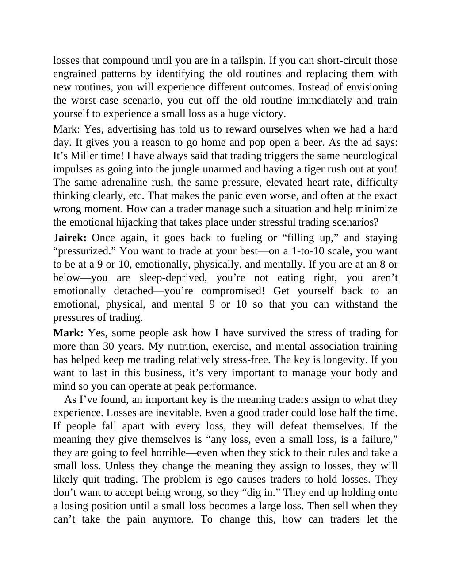

# Think and Trade Like a Champion - Page Image 186

## Source Page

Book: [[Think and Trade Like a Champion]]

## Page Read

Tags: text-or-context-page

Concepts: [[Mental Discipline]]

This page is mainly text/context. It is included so the image index has complete source coverage, but it should not be treated as an independent chart pattern.

## Linked Stock Figures

- No extracted stock-figure case on this page.

## Extracted Page Text Signal

losses that compound until you are in a tailspin. If you can short-circuit those engrained patterns by identifying the old routines and replacing them with new routines, you will experience different outcomes. Instead of envisioning the worst-case scenario, you cut off the old routine immediately and train yourself to experience a small loss as a huge victory. Mark: Yes, advertising has told us to reward ourselves when we had a hard day. It gives you a reason to go home and pop open a beer. As t...

## Manual Study Prompt

- What visual structure is the page trying to make obvious?
- Is the lesson about buying, avoiding, selling, or managing risk?
- If a ticker is not present, what generic behavior does the image teach?
- If a ticker is present, does the linked OHLCV rebuild confirm the same behavior?
