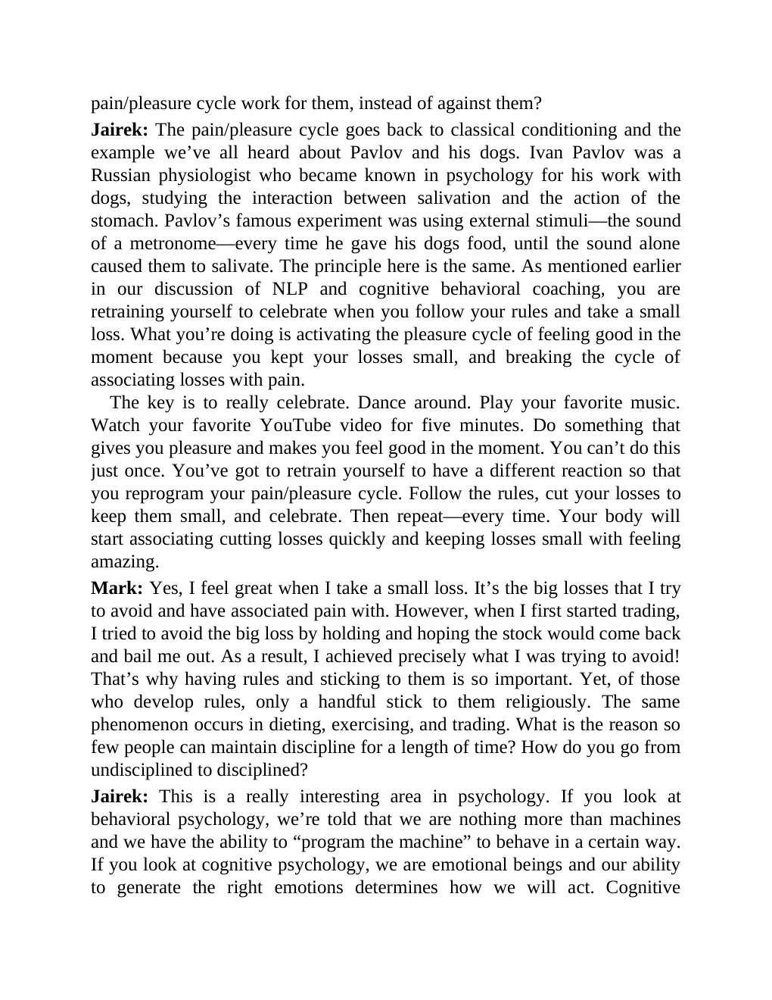

# Think and Trade Like a Champion - Page Image 187

## Source Page

Book: [[Think and Trade Like a Champion]]

## Page Read

Tags: text-or-context-page

Concepts: [[Mental Discipline]]

This page is mainly text/context. It is included so the image index has complete source coverage, but it should not be treated as an independent chart pattern.

## Linked Stock Figures

- No extracted stock-figure case on this page.

## Extracted Page Text Signal

pain/pleasure cycle work for them, instead of against them? Jairek: The pain/pleasure cycle goes back to classical conditioning and the example we’ve all heard about Pavlov and his dogs. Ivan Pavlov was a Russian physiologist who became known in psychology for his work with dogs, studying the interaction between salivation and the action of the stomach. Pavlov’s famous experiment was using external stimuli-the sound of a metronome-every time he gave his dogs food, until the sound alone caused th...

## Manual Study Prompt

- What visual structure is the page trying to make obvious?
- Is the lesson about buying, avoiding, selling, or managing risk?
- If a ticker is not present, what generic behavior does the image teach?
- If a ticker is present, does the linked OHLCV rebuild confirm the same behavior?
