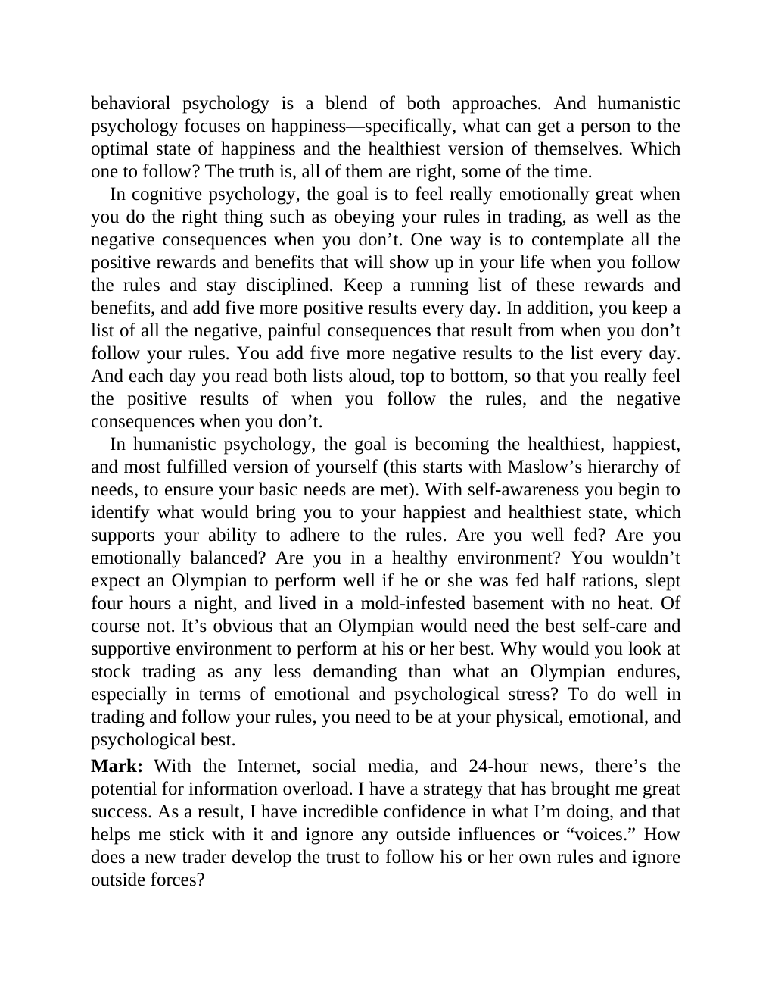

# Think and Trade Like a Champion - Page Image 188

## Source Page

Book: [[Think and Trade Like a Champion]]

## Page Read

Tags: mental-discipline, text-or-context-page

Concepts: [[Mental Discipline]]

This page is mainly text/context. It is included so the image index has complete source coverage, but it should not be treated as an independent chart pattern.

## Linked Stock Figures

- No extracted stock-figure case on this page.

## Extracted Page Text Signal

behavioral psychology is a blend of both approaches. And humanistic psychology focuses on happiness-specifically, what can get a person to the optimal state of happiness and the healthiest version of themselves. Which one to follow? The truth is, all of them are right, some of the time. In cognitive psychology, the goal is to feel really emotionally great when you do the right thing such as obeying your rules in trading, as well as the negative consequences when you don’t. One way is to contempl...

## Manual Study Prompt

- What visual structure is the page trying to make obvious?
- Is the lesson about buying, avoiding, selling, or managing risk?
- If a ticker is not present, what generic behavior does the image teach?
- If a ticker is present, does the linked OHLCV rebuild confirm the same behavior?
