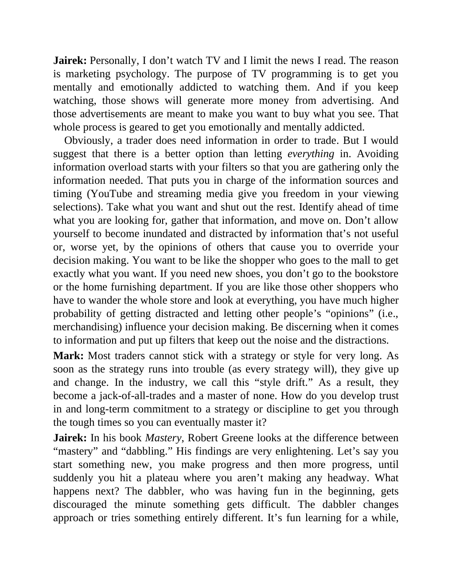

# Think and Trade Like a Champion - Page Image 189

## Source Page

Book: [[Think and Trade Like a Champion]]

## Page Read

Tags: text-or-context-page

Concepts: [[Mental Discipline]]

This page is mainly text/context. It is included so the image index has complete source coverage, but it should not be treated as an independent chart pattern.

## Linked Stock Figures

- No extracted stock-figure case on this page.

## Extracted Page Text Signal

Jairek: Personally, I don’t watch TV and I limit the news I read. The reason is marketing psychology. The purpose of TV programming is to get you mentally and emotionally addicted to watching them. And if you keep watching, those shows will generate more money from advertising. And those advertisements are meant to make you want to buy what you see. That whole process is geared to get you emotionally and mentally addicted. Obviously, a trader does need information in order to trade. But I would ...

## Manual Study Prompt

- What visual structure is the page trying to make obvious?
- Is the lesson about buying, avoiding, selling, or managing risk?
- If a ticker is not present, what generic behavior does the image teach?
- If a ticker is present, does the linked OHLCV rebuild confirm the same behavior?
