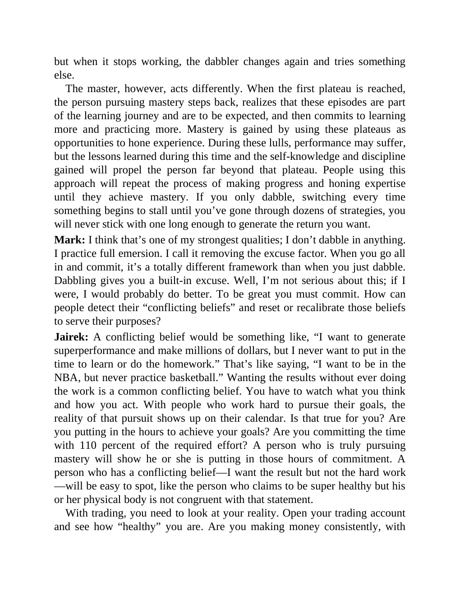

# Think and Trade Like a Champion - Page Image 190

## Source Page

Book: [[Think and Trade Like a Champion]]

## Page Read

Tags: mental-discipline, risk-first, text-or-context-page

Concepts: [[Mental Discipline]], [[Risk First]]

This page is mainly text/context. It is included so the image index has complete source coverage, but it should not be treated as an independent chart pattern.

## Linked Stock Figures

- No extracted stock-figure case on this page.

## Extracted Page Text Signal

but when it stops working, the dabbler changes again and tries something else. The master, however, acts differently. When the first plateau is reached, the person pursuing mastery steps back, realizes that these episodes are part of the learning journey and are to be expected, and then commits to learning more and practicing more. Mastery is gained by using these plateaus as opportunities to hone experience. During these lulls, performance may suffer, but the lessons learned during this time an...

## Manual Study Prompt

- What visual structure is the page trying to make obvious?
- Is the lesson about buying, avoiding, selling, or managing risk?
- If a ticker is not present, what generic behavior does the image teach?
- If a ticker is present, does the linked OHLCV rebuild confirm the same behavior?
