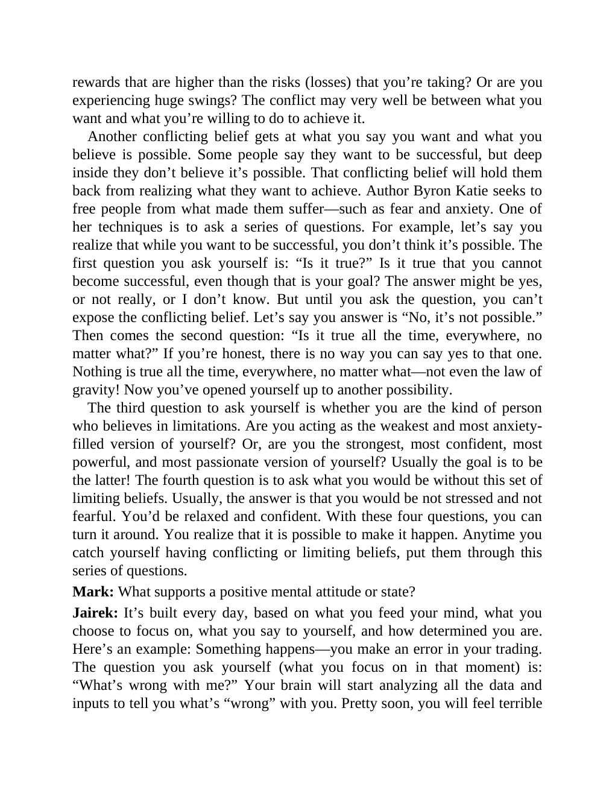

# Think and Trade Like a Champion - Page Image 191

## Source Page

Book: [[Think and Trade Like a Champion]]

## Page Read

Tags: risk-first, text-or-context-page

Concepts: [[Risk First]]

This page is mainly text/context. It is included so the image index has complete source coverage, but it should not be treated as an independent chart pattern.

## Linked Stock Figures

- No extracted stock-figure case on this page.

## Extracted Page Text Signal

rewards that are higher than the risks (losses) that you’re taking? Or are you experiencing huge swings? The conflict may very well be between what you want and what you’re willing to do to achieve it. Another conflicting belief gets at what you say you want and what you believe is possible. Some people say they want to be successful, but deep inside they don’t believe it’s possible. That conflicting belief will hold them back from realizing what they want to achieve. Author Byron Katie seeks to...

## Manual Study Prompt

- What visual structure is the page trying to make obvious?
- Is the lesson about buying, avoiding, selling, or managing risk?
- If a ticker is not present, what generic behavior does the image teach?
- If a ticker is present, does the linked OHLCV rebuild confirm the same behavior?
