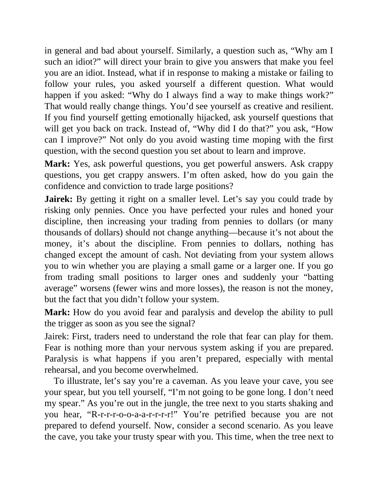

# Think and Trade Like a Champion - Page Image 192

## Source Page

Book: [[Think and Trade Like a Champion]]

## Page Read

Tags: mental-discipline, risk-first, text-or-context-page

Concepts: [[Mental Discipline]], [[Risk First]]

This page is mainly text/context. It is included so the image index has complete source coverage, but it should not be treated as an independent chart pattern.

## Linked Stock Figures

- No extracted stock-figure case on this page.

## Extracted Page Text Signal

in general and bad about yourself. Similarly, a question such as, “Why am I such an idiot?” will direct your brain to give you answers that make you feel you are an idiot. Instead, what if in response to making a mistake or failing to follow your rules, you asked yourself a different question. What would happen if you asked: “Why do I always find a way to make things work?” That would really change things. You’d see yourself as creative and resilient. If you find yourself getting emotionally hij...

## Manual Study Prompt

- What visual structure is the page trying to make obvious?
- Is the lesson about buying, avoiding, selling, or managing risk?
- If a ticker is not present, what generic behavior does the image teach?
- If a ticker is present, does the linked OHLCV rebuild confirm the same behavior?
