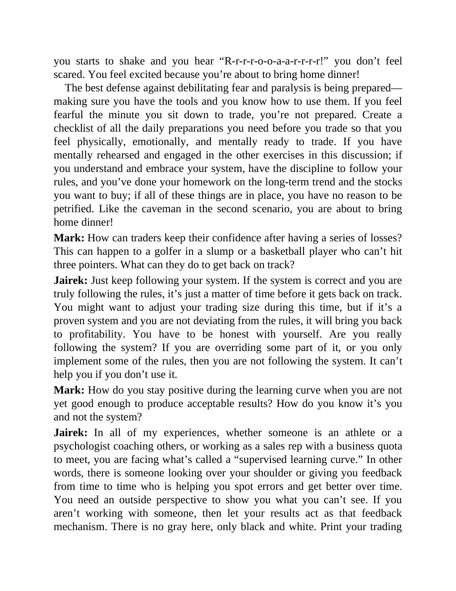

# Think and Trade Like a Champion - Page Image 193

## Source Page

Book: [[Think and Trade Like a Champion]]

## Page Read

Tags: mental-discipline, text-or-context-page

Concepts: [[Mental Discipline]]

This page is mainly text/context. It is included so the image index has complete source coverage, but it should not be treated as an independent chart pattern.

## Linked Stock Figures

- No extracted stock-figure case on this page.

## Extracted Page Text Signal

you starts to shake and you hear “R-r-r-r-o-o-a-a-r-r-r-r!” you don’t feel scared. You feel excited because you’re about to bring home dinner! The best defense against debilitating fear and paralysis is being prepared- making sure you have the tools and you know how to use them. If you feel fearful the minute you sit down to trade, you’re not prepared. Create a checklist of all the daily preparations you need before you trade so that you feel physically, emotionally, and mentally ready to trade....

## Manual Study Prompt

- What visual structure is the page trying to make obvious?
- Is the lesson about buying, avoiding, selling, or managing risk?
- If a ticker is not present, what generic behavior does the image teach?
- If a ticker is present, does the linked OHLCV rebuild confirm the same behavior?
