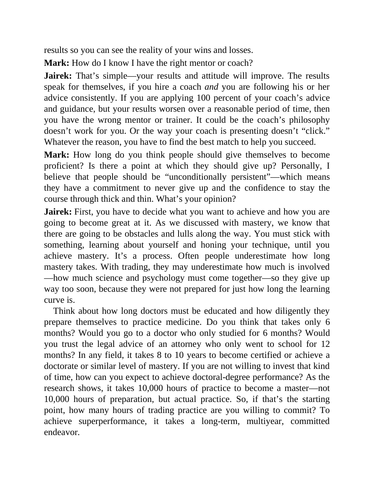

# Think and Trade Like a Champion - Page Image 194

## Source Page

Book: [[Think and Trade Like a Champion]]

## Page Read

Tags: text-or-context-page

Concepts: [[Mental Discipline]]

This page is mainly text/context. It is included so the image index has complete source coverage, but it should not be treated as an independent chart pattern.

## Linked Stock Figures

- No extracted stock-figure case on this page.

## Extracted Page Text Signal

results so you can see the reality of your wins and losses. Mark: How do I know I have the right mentor or coach? Jairek: That’s simple-your results and attitude will improve. The results speak for themselves, if you hire a coach and you are following his or her advice consistently. If you are applying 100 percent of your coach’s advice and guidance, but your results worsen over a reasonable period of time, then you have the wrong mentor or trainer. It could be the coach’s philosophy doesn’t wor...

## Manual Study Prompt

- What visual structure is the page trying to make obvious?
- Is the lesson about buying, avoiding, selling, or managing risk?
- If a ticker is not present, what generic behavior does the image teach?
- If a ticker is present, does the linked OHLCV rebuild confirm the same behavior?
