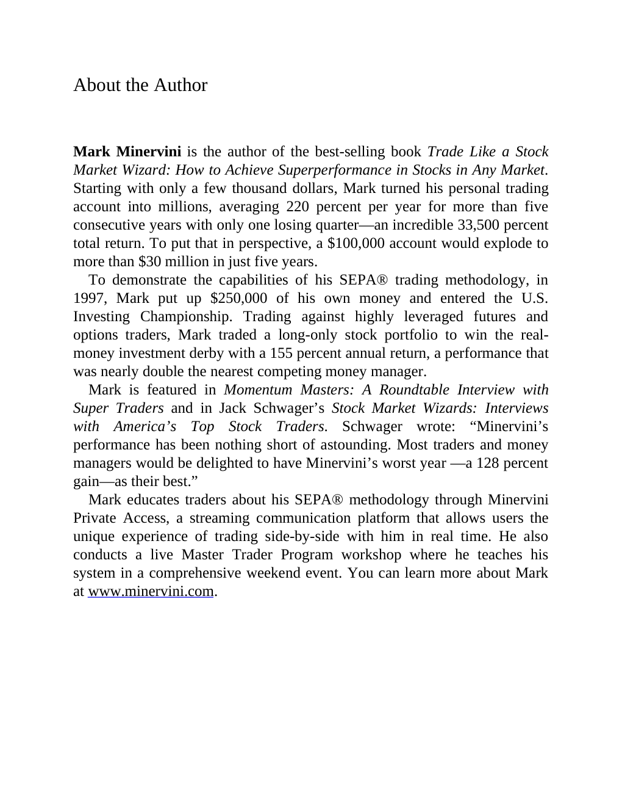

# Think and Trade Like a Champion - Page Image 196

## Source Page

Book: [[Think and Trade Like a Champion]]

## Page Read

Tags: sell-or-failure, text-or-context-page

Concepts: [[Sell Rules and Failure Signals]]

This page is mainly text/context. It is included so the image index has complete source coverage, but it should not be treated as an independent chart pattern.

## Linked Stock Figures

- No extracted stock-figure case on this page.

## Extracted Page Text Signal

About the Author Mark Minervini is the author of the best-selling book Trade Like a Stock Market Wizard: How to Achieve Superperformance in Stocks in Any Market. Starting with only a few thousand dollars, Mark turned his personal trading account into millions, averaging 220 percent per year for more than five consecutive years with only one losing quarter-an incredible 33,500 percent total return. To put that in perspective, a $100,000 account would explode to more than $30 million in just five ...

## Manual Study Prompt

- What visual structure is the page trying to make obvious?
- Is the lesson about buying, avoiding, selling, or managing risk?
- If a ticker is not present, what generic behavior does the image teach?
- If a ticker is present, does the linked OHLCV rebuild confirm the same behavior?
