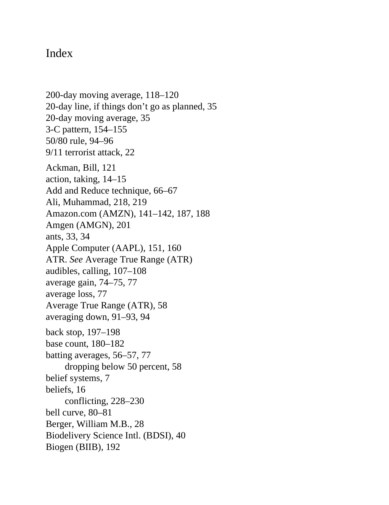

# Think and Trade Like a Champion - Page Image 197

## Source Page

Book: [[Think and Trade Like a Champion]]

## Page Read

Tags: risk-first, text-or-context-page

Concepts: [[Risk First]]

This page is mainly text/context. It is included so the image index has complete source coverage, but it should not be treated as an independent chart pattern.

## Linked Stock Figures

- No extracted stock-figure case on this page.

## Extracted Page Text Signal

Index 200-day moving average, 118-120 20-day line, if things don’t go as planned, 35 20-day moving average, 35 3-C pattern, 154-155 50/80 rule, 94-96 9/11 terrorist attack, 22 Ackman, Bill, 121 action, taking, 14-15 Add and Reduce technique, 66-67 Ali, Muhammad, 218, 219 Amazon.com (AMZN), 141-142, 187, 188 Amgen (AMGN), 201 ants, 33, 34 Apple Computer (AAPL), 151, 160 ATR. See Average True Range (ATR) audibles, calling, 107-108 average gain, 74-75, 77 average loss, 77 Average True Range (ATR), ...

## Manual Study Prompt

- What visual structure is the page trying to make obvious?
- Is the lesson about buying, avoiding, selling, or managing risk?
- If a ticker is not present, what generic behavior does the image teach?
- If a ticker is present, does the linked OHLCV rebuild confirm the same behavior?
