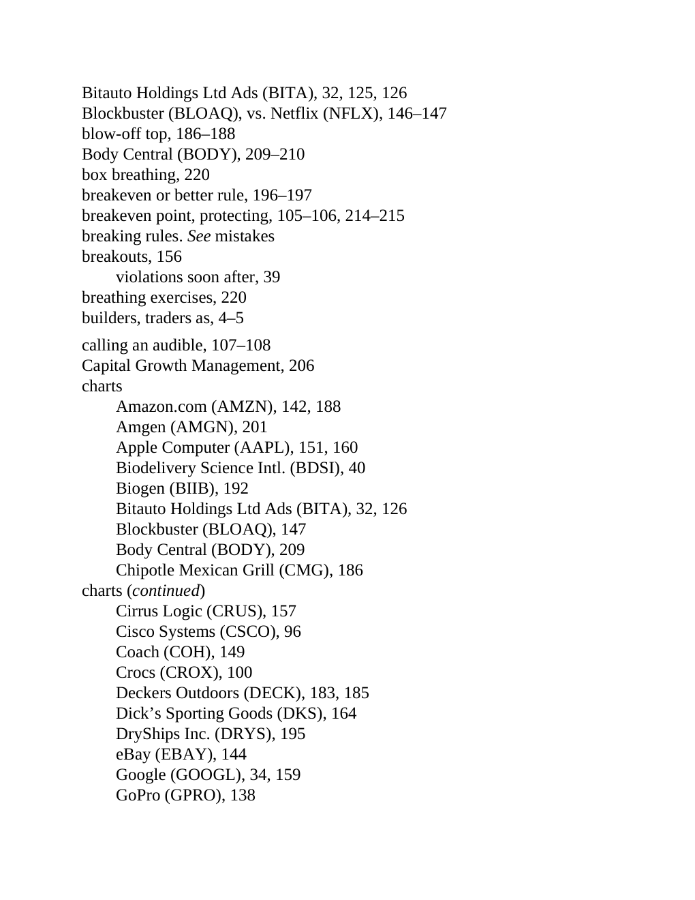

# Think and Trade Like a Champion - Page Image 198

## Source Page

Book: [[Think and Trade Like a Champion]]

## Page Read

Tags: ipo-or-new-issue, mental-discipline, pivot-or-entry, text-or-context-page, volume-behavior

Concepts: [[IPO Base New Issue Setup|IPO Base / New Issue Setup]], [[Mental Discipline]], [[Pivot and Entry]], [[Volume Dry-Up and Accumulation]]

This page is mainly text/context. It is included so the image index has complete source coverage, but it should not be treated as an independent chart pattern.

## Linked Stock Figures

- No extracted stock-figure case on this page.

## Extracted Page Text Signal

Bitauto Holdings Ltd Ads (BITA), 32, 125, 126 Blockbuster (BLOAQ), vs. Netflix (NFLX), 146-147 blow-off top, 186-188 Body Central (BODY), 209-210 box breathing, 220 breakeven or better rule, 196-197 breakeven point, protecting, 105-106, 214-215 breaking rules. See mistakes breakouts, 156 violations soon after, 39 breathing exercises, 220 builders, traders as, 4-5 calling an audible, 107-108 Capital Growth Management, 206 charts Amazon.com (AMZN), 142, 188 Amgen (AMGN), 201 Apple Computer (AAPL),...

## Manual Study Prompt

- What visual structure is the page trying to make obvious?
- Is the lesson about buying, avoiding, selling, or managing risk?
- If a ticker is not present, what generic behavior does the image teach?
- If a ticker is present, does the linked OHLCV rebuild confirm the same behavior?
