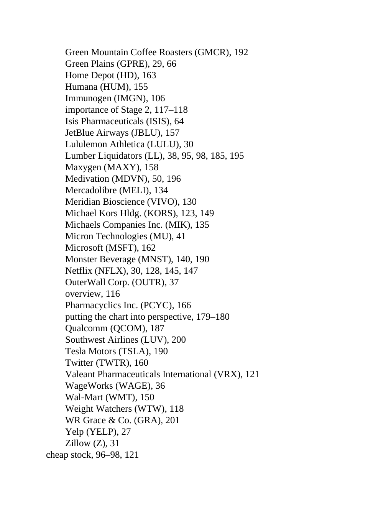

# Think and Trade Like a Champion - Page Image 199

## Source Page

Book: [[Think and Trade Like a Champion]]

## Page Read

Tags: stage-2-uptrend, text-or-context-page

Concepts: [[Stage 2 Uptrend]]

This page is mainly text/context. It is included so the image index has complete source coverage, but it should not be treated as an independent chart pattern.

## Linked Stock Figures

- No extracted stock-figure case on this page.

## Extracted Page Text Signal

Green Mountain Coffee Roasters (GMCR), 192 Green Plains (GPRE), 29, 66 Home Depot (HD), 163 Humana (HUM), 155 Immunogen (IMGN), 106 importance of Stage 2, 117-118 Isis Pharmaceuticals (ISIS), 64 JetBlue Airways (JBLU), 157 Lululemon Athletica (LULU), 30 Lumber Liquidators (LL), 38, 95, 98, 185, 195 Maxygen (MAXY), 158 Medivation (MDVN), 50, 196 Mercadolibre (MELI), 134 Meridian Bioscience (VIVO), 130 Michael Kors Hldg. (KORS), 123, 149 Michaels Companies Inc. (MIK), 135 Micron Technologies (MU),...

## Manual Study Prompt

- What visual structure is the page trying to make obvious?
- Is the lesson about buying, avoiding, selling, or managing risk?
- If a ticker is not present, what generic behavior does the image teach?
- If a ticker is present, does the linked OHLCV rebuild confirm the same behavior?
