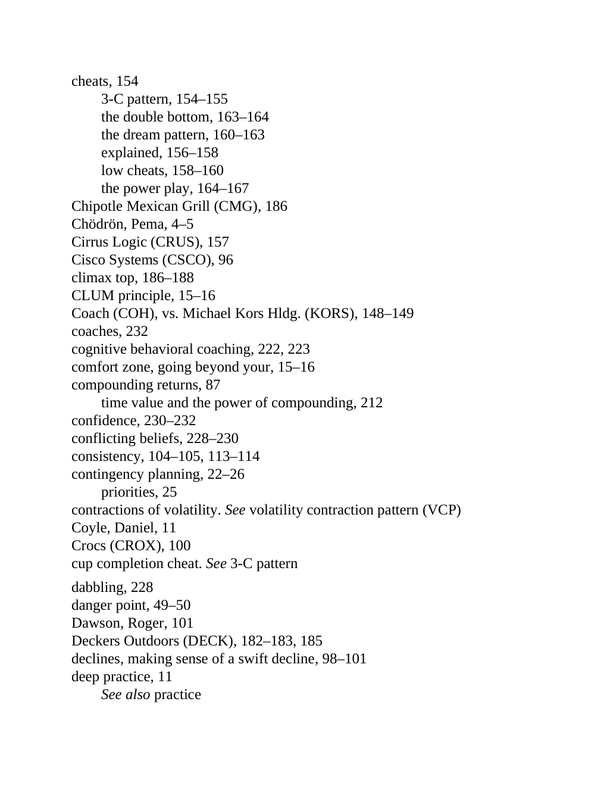

# Think and Trade Like a Champion - Page Image 200

## Source Page

Book: [[Think and Trade Like a Champion]]

## Page Read

Tags: ipo-or-new-issue, text-or-context-page, vcp-or-tightening

Concepts: [[IPO Base New Issue Setup|IPO Base / New Issue Setup]], [[Volatility Contraction Pattern]]

This page is mainly text/context. It is included so the image index has complete source coverage, but it should not be treated as an independent chart pattern.

## Linked Stock Figures

- No extracted stock-figure case on this page.

## Extracted Page Text Signal

cheats, 154 3-C pattern, 154-155 the double bottom, 163-164 the dream pattern, 160-163 explained, 156-158 low cheats, 158-160 the power play, 164-167 Chipotle Mexican Grill (CMG), 186 Chödrön, Pema, 4-5 Cirrus Logic (CRUS), 157 Cisco Systems (CSCO), 96 climax top, 186-188 CLUM principle, 15-16 Coach (COH), vs. Michael Kors Hldg. (KORS), 148-149 coaches, 232 cognitive behavioral coaching, 222, 223 comfort zone, going beyond your, 15-16 compounding returns, 87 time value and the power of compoundi...

## Manual Study Prompt

- What visual structure is the page trying to make obvious?
- Is the lesson about buying, avoiding, selling, or managing risk?
- If a ticker is not present, what generic behavior does the image teach?
- If a ticker is present, does the linked OHLCV rebuild confirm the same behavior?
