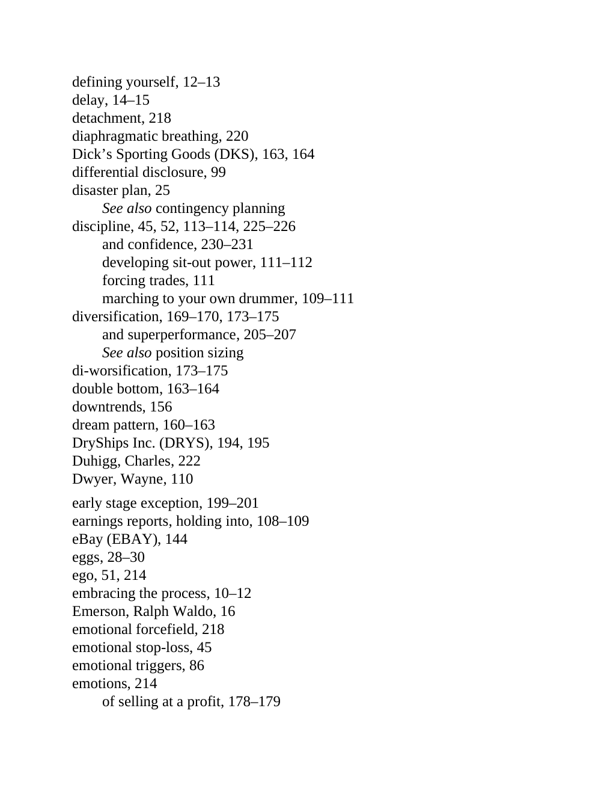

# Think and Trade Like a Champion - Page Image 201

## Source Page

Book: [[Think and Trade Like a Champion]]

## Page Read

Tags: mental-discipline, risk-first, sell-or-failure, text-or-context-page, volume-behavior

Concepts: [[Mental Discipline]], [[Risk First]], [[Sell Rules and Failure Signals]], [[Volume Dry-Up and Accumulation]]

This page is mainly text/context. It is included so the image index has complete source coverage, but it should not be treated as an independent chart pattern.

## Linked Stock Figures

- No extracted stock-figure case on this page.

## Extracted Page Text Signal

defining yourself, 12-13 delay, 14-15 detachment, 218 diaphragmatic breathing, 220 Dick’s Sporting Goods (DKS), 163, 164 differential disclosure, 99 disaster plan, 25 See also contingency planning discipline, 45, 52, 113-114, 225-226 and confidence, 230-231 developing sit-out power, 111-112 forcing trades, 111 marching to your own drummer, 109-111 diversification, 169-170, 173-175 and superperformance, 205-207 See also position sizing di-worsification, 173-175 double bottom, 163-164 downtrends, ...

## Manual Study Prompt

- What visual structure is the page trying to make obvious?
- Is the lesson about buying, avoiding, selling, or managing risk?
- If a ticker is not present, what generic behavior does the image teach?
- If a ticker is present, does the linked OHLCV rebuild confirm the same behavior?
